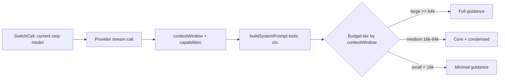

# Route-Aware System Prompt — Implementation Plan

## 0. Hard Dependencies

- [x] **`09.1-mid-turn-model-switch` (merged + deleted).** Shipped the per-turn
  `SwitchCell` (`apps/agent-host/src/agent/switch-cell.ts`) and the step-boundary
  model/reasoning re-read in `runAgent` (`apps/agent-host/src/agent/loop.ts`). This
  plan threads the *current step's* served model into the prompt builder; because
  the loop already re-reads the model at each step boundary and `buildSystemPrompt`
  is called per step (`pi-ai.ts:406`), the adapted prompt tracks mid-turn switches
  with **no new re-read boundary**. <!-- D-003 -->
- [x] **`ModelCapabilities` + `contextWindow` already exist and are threaded to the
  provider.** `ModelCapabilities { images, tools, contextLength }` lives at
  `apps/agent-host/src/providers/types.ts:31`, and `contextWindow` is carried on
  every provider stream call (`pi-ai.ts:210`, `pi-ai.ts:380`). The data this plan
  needs is available at the prompt-build call site today; it just does not reach
  `SystemPromptContext`. <!-- D-001 -->

No unmerged plan blocks this work.

## Architecture

The system prompt is assembled by `SystemPromptBuilder.build()` in
`apps/agent-host/src/providers/system-prompt.ts`. Today `SystemPromptContext`
carries only `workspaceRoot`, `cwd`, and `styleGuidance`; the builder produces one
fixed prompt regardless of which model serves the turn. Meanwhile the host already
knows, per step, the served model's `ModelCapabilities` and the `contextWindow` it
is loaded at — data that is threaded through the provider stream but never handed to
the builder.

This plan closes that one seam. `SystemPromptContext` gains the served model's
`capabilities` and `contextWindow`; the builder uses them to select a **guidance
budget tier** that controls how much of the fixed guidance is emitted. The
adaptation is purely about *prompt density* — how many of the detailed tool-guidance
blocks (LSP, MCP, docs, archive, delegate, tool_script) are included — not about
telling the model which family it is or changing the tool inventory the route
advertises.

### Key Constraints

| Constraint | Impact |
|-----------|--------|
| The prompt is rebuilt every step (`pi-ai.ts:406`); the model is re-readable every step (09.1). | Adaptation is per-step and free — no caching invalidation problem, no new boundary. |
| `promptOverheadChars` is the single owner of the fixed-overhead estimate and is shared by the turn breakdown seed and the provider overflow estimate. | Any tier that changes prompt length is automatically reflected in both — no second formula. |
| LM Studio silently truncates over-window prompts (rolling window). | A leaner prompt for small local windows is not cosmetic — it prevents the oldest messages being dropped mid-turn. |
| The advertised tool inventory is owned by the route, not the builder. | The builder narrows *guidance text*, not the tool schemas sent to the model. The inventory and the guidance must never drift (existing invariant). |

### Boundaries

- **Builder owns prompt density selection.** Given `capabilities` + `contextWindow`,
  it picks the tier and emits the corresponding guidance subset. It does **not** own
  model selection, routing, or which tools are offered — those stay with the route /
  turn pipeline.
- **Call sites own data threading.** `pi-ai.ts` (the live per-step build) and
  `turn.ts` (the breakdown-seed estimate) already hold `contextWindow` and can reach
  `capabilities`; they pass them into `SystemPromptContext`. The builder stays
  unaware of *how* the window is chosen or stored (mirrors the existing
  `styleGuidance` pattern).
- **No model-identity text.** The prompt never asserts "you are Claude/Gemini/etc."
  Tiers are selected by the host from objective data; the model is not told its own
  name as a behavioral lever. <!-- D-002 -->

### Observability

The existing per-step breakdown (`BreakdownAccumulator`, seeded from
`promptOverheadChars`) already reports fixed overhead. Because a leaner prompt
shortens the fixed-overhead seed, the token-source breakdown will naturally reflect
the tier in effect — an operator can see "fixed overhead dropped after the switch to
the local model" without a new metric. No new span or event is required for M1; if
the tier decision itself needs to be visible (e.g. in `/doctor`), that is a later
add on the Provider/Models area owned by plan 41.

## Non-Goals

- **No model-identity / family text injection.** "You are Claude" is not a
  capability switch; reasoning models do not benefit from a name tag, and per-family
  formatting tics are handled by the global calibration rules that already exist.
- **No routing engine.** Model selection stays manual (or, later, with 09.1's
  `auto` initiator). This plan adapts the prompt *to* the route; it never changes
  the route. The routing engine is on the DROP list (repo-root `AGENTS.md`).
- **No tool-inventory narrowing.** The builder emits guidance text for the tools the
  route advertises; it does not remove tools from the offered set. Capability-gated
  tool suppression (e.g. dropping vision-only guidance when `images: false`) is a
  separate concern and is explicitly out of scope for the first cutoff.
- **No per-family calibration overrides.** No "Anthropic block", "Gemini block"
  tables. Tiers are window-based, not vendor-based.

## Phases

### Phase 1: Thread route data into the builder (the seam)

**Goal:** `SystemPromptContext` carries `capabilities` and `contextWindow`, and the
builder receives them at every call site — but does not yet *use* them (behavior is
byte-identical to today). This is the plumbing milestone; it is verifiable on its
own because the prompt is unchanged.

**Gate from previous:** none.

#### M1: Extend SystemPromptContext and thread the call sites

- **Dependencies:** none
- **Effort:** S (1-2d)
- **Tasks:**
  1. RED: Add a unit test asserting `buildSystemPrompt(tools, { contextWindow, capabilities })` does not throw and still produces the full prompt when `contextWindow` is large/absent (characterization: byte-identical to today).
  2. GREEN: Add optional `capabilities?: ModelCapabilities` and `contextWindow?: number` fields to `SystemPromptContext` (`system-prompt.ts`). Do not read them yet.
  3. RED: Add a test asserting the `turn.ts` breakdown-seed call passes a `contextWindow` when one is available on the turn provider (spy/stub the builder to capture the context).
  4. GREEN: Thread `contextWindow` (and `capabilities` where reachable) from the `pi-ai.ts:406` live build and the `turn.ts:167` breakdown-seed build into `SystemPromptContext`.
  5. REFACTOR: Ensure no call site constructs a `SystemPromptContext` without considering the route data — a single helper if construction is repeated.

### Phase 2: Budget-tier guidance narrowing

**Goal:** For small served windows the builder emits a leaner prompt (drops or
condenses the low-value detailed blocks); for large windows the full prompt is
unchanged. The tier is driven by `contextWindow` (the served window), not
`contextLength`. <!-- D-004 -->

**Gate from previous:** M1 merged — the seam exists and is threaded.

#### M2: Define the tier policy and the condensed guidance set

- **Dependencies:** M1
- **Effort:** M (3-5d)
- **Tasks:**
  1. RED: Write a unit test asserting that with `contextWindow` below the small-tier threshold (e.g. 16k), the prompt omits the detailed LSP/MCP/docs/archive/delegate/tool_script guidance blocks but retains identity, execution context, core coding guidance, and confinement.
  2. GREEN: Implement a pure `guidanceTier(contextWindow): "full" | "core" | "minimal"` selector and a tier-aware guidance renderer in the builder. Initially: full (>= 64k), core (16k-64k), minimal (< 16k).
  3. RED: Add a test asserting the medium tier keeps a condensed form (not fully dropped) of the high-value blocks — verify a representative phrase from each retained block is present and a representative phrase from each dropped block is absent.
  4. GREEN: Implement the condensed rendering for the core tier (short forms of the tool guidance).
  5. RED: Add a test asserting that when `contextWindow` is absent/unknown the builder falls back to the full prompt (never silently narrows on missing data).
  6. GREEN: Implement the absent-data fallback to `"full"`.
  7. REFACTOR: Consolidate the tier thresholds and the per-tier block lists into one declared table so the policy is one read, not scattered conditionals.

#### M3: promptOverheadChars and breakdown consistency

- **Dependencies:** M2
- **Effort:** S (1-2d)
- **Tasks:**
  1. RED: Add a test asserting `promptOverheadChars` reflects the *tier-adapted* prompt length (the breakdown seed must shrink for a small-window turn, not assume the full prompt).
  2. GREEN: Ensure the breakdown-seed call in `turn.ts` passes the route data so `promptOverheadChars` measures the prompt the model will actually receive.
  3. REFACTOR: Confirm the single-formula invariant — the breakdown seed and the provider overflow estimate still use the same `promptOverheadChars` and cannot disagree.

### Phase 3: Verification and edge cases

**Goal:** The adaptation is correct across the cases that matter: large cloud
turns unchanged, small local turns leaner, mid-turn switches re-tier on the next
step, and missing data is safe.

**Gate from previous:** M3 merged.

#### M4: Mid-turn switch and hermetic verification

- **Dependencies:** M3
- **Effort:** M (3-5d)
- **Tasks:**
  1. RED: Add an integration test (the hermetic lane / `test/turn.test.ts` shape) that switches mid-turn from a large-window model to a small-window model via the `SwitchCell` and asserts the prompt built for the post-switch step is the leaner tier.
  2. GREEN: Confirm the per-step `buildSystemPrompt` call picks up the new `contextWindow` after the switch (this should require no new code if M1 is correct — the test characterizes the 09.1 composition).
  3. RED: Add a test asserting a turn whose provider reports `contextLength` large but `contextWindow` small gets the small tier (served window wins). <!-- D-004 -->
  4. GREEN: Confirm the tier selector reads `contextWindow`, not `contextLength`.
  5. REFACTOR: Move the tier table and guidance block map behind the builder's existing single-read point so call sites stay ignorant of the policy.

## Open Questions

- **Exact tier thresholds.** 16k / 64k are initial placeholders drawn from the
  existing 16k minimum-to-run guard and typical cloud windows. The right cuts
  depend on measuring real `promptOverheadChars` values across the tool surface;
  M2's RED tests pin the behavior, the numbers are tuned during GREEN.
- **Whether `capabilities.tools: false` should suppress tool guidance entirely.**
  The no-tools route already drops the inventory and guidance
  (`system-prompt.ts` build path), so this may already be handled. Confirm during
  M2; if not, it is a small follow-up, not a new plan.
