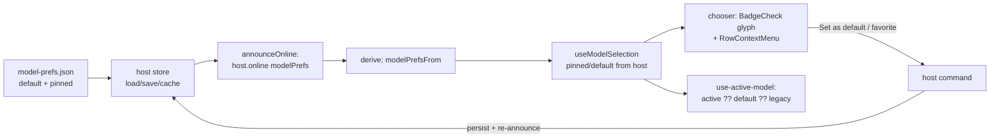

# Model Favorites and Default — Implementation Plan

## 0. Hard Dependencies

None. All the pieces this plan touches already exist on `main`:

- The pure preferences model already carries `default: ModelRef | null` and
  `pinned` (favorites) with pure transitions `setDefaultModel` / `pinModel` /
  `unpinModel` and a tolerant `decodeModelPreferences`
  (`packages/session/src/model-preferences.ts:135-153`,`:200`). "Favorites" is
  already `pinned`; the model rows already render a pin Star
  (`apps/web/src/components/chooser/model-chooser.tsx:634-649`). The gaps are the
  default UI, the host-side storage, and the initial-pick wiring — not new data.
- The host already ships two host-owned config-file preferences the same way this
  plan needs (`apps/agent-host/src/prefs/vim-store.ts`,
  `apps/agent-host/src/prefs/style-store.ts`) over the shared config scaffold
  (`apps/agent-host/src/boot/config.ts` `loadJsonConfig`/`writeJsonConfig`), and
  already announces one such preference (`vimEnabled`) on `host.online`
  (`apps/agent-host/src/transport/presence.ts:79-123`) read via
  `apps/web/src/derive.ts:342`. This plan follows that proven path exactly.

No unmerged plan blocks this work.

## Architecture

**The reset bug.** Every new session resets to the hardcoded
`DEFAULT_PROVIDER = "qwen"` (`apps/agent-host/src/providers/index.ts:54`) with
reasoning off, for three compounding reasons:

1. There is no UI to set a *default* model at all.
2. The `default` + favorites that the preferences model *does* support live in a
   browser-global localStorage blob (`GLOBAL_PREFS_KEY =
   "trevor.modelPreferences.global"`, `apps/web/src/hooks/use-model-selection.ts:37`),
   so they are per-browser/origin and never durable across machines or a cleared
   store.
3. The initial-model pick never consults `preferences.default`:
   `sendModel = selection.active ?? activeModelRef`
   (`apps/web/src/hooks/use-active-model.ts:78`), and `selection.active` collapses
   `preferences.active ?? legacyRef`, where `legacyRef` resolves to the host
   default `qwen` for a fresh session. So the default, even when set, was
   unreachable.

**The shape of the fix.** The default and favorites become a **host-owned
preference** — the same class as vim.json / style.json — persisted at
`~/.trevorV2/model-prefs.json`, announced on `host.online`, and mutated through a
host command that re-announces. Host-side storage makes them durable and shared
across every session and browser tab talking to that host, which is what actually
closes the reset. The browser reads `default` / `pinned` from the announcement
(recent + active + per-model reasoning stay browser-side, where they belong), the
chooser gains a way to *set* the default and a distinct glyph to *see* it, every
list sorts default → favorites → rest, and the initial pick finally consults the
default. <!-- D-001 -->



### Key Constraints

| Constraint | Impact |
|-----------|--------|
| `STORAGE_INVENTORY` (`packages/session/src/node-paths.ts:223`) is the enforced extension point for any `~/.trevorV2` file (D-006 of the root taxonomy); a host drift guard fails on a raw `~/.trevorV2` literal outside the owner module. | The new file MUST be declared as a `"config"` inventory entry and its path constant added to `boot/paths.ts`, not hand-joined. |
| `host.online` fields are additive + optional (`vimEnabled?`, `jobs?` …), read through defaulting derive helpers. | `modelPrefs?` rides the same way; an older host that omits it yields empty default/favorites, never a crash. |
| `selection.active` already collapses `preferences.active ?? legacyRef` (qwen for a fresh session). | The default must be inserted **between** an explicit per-session `active` and the legacy fallback (`active ?? default ?? legacy`); the naive `selection.active ?? default` short-circuits on qwen and never uses the default. <!-- D-005 --> |
| A `ModelRow` is a row of nested buttons (select button + pin Star button). | The right-click "Set as default / favorite" menu must attach to the row *wrapper* and reuse the `RowContextMenu` template that already solves this in `session-sidebar.tsx:288`, not add another inline button. <!-- D-002 --> |
| Star = favorite and Check = selected are already taken on a `ModelRow`. | The default needs a *third*, distinct glyph — `BadgeCheck` (lucide) — so default, favorite, and selected read as three separable states on one row. <!-- D-002 --> |

### Boundaries

- **Host owns the durable preference.** A new `model-prefs-store.ts` under
  `apps/agent-host/src/prefs` load/save/caches `{ default, pinned }` at
  `USER_MODEL_PREFS_JSON`, reusing the pure `setDefaultModel` / `pinModel` /
  `unpinModel` + `decodeModelPreferences` transitions from
  `@trevor/session`. It mirrors `vim-store.ts`/`style-store.ts` (injectable
  read/write, read-once cache, cache-clear on save). It does NOT render or decide
  UI — it is the persistence + cache seam only. <!-- D-001 -->
- **Protocol carries the read model; the browser renders it.** `host.online` gains
  an optional `modelPrefs: { default; pinned }`; `presence.ts` announces it from the
  store's cache; `derive.ts` exposes `modelPrefsFrom(announcement)`. The browser
  never hardcodes a default and never persists default/pinned locally again. <!-- D-001 -->
- **Mutation is a host round-trip, not a local write.** Setting the default or
  toggling a favorite sends a host command (the `/vim`/`/style` re-announce pattern
  in `main.ts:726-730`); the host persists and re-announces, and the browser
  re-renders from the fresh announcement. The web's `setDefault` / `togglePin` route
  through that command instead of localStorage. <!-- D-001 -->
- **Ordering + the pick are pure and shared.** The default → favorites → rest sort
  and the `defaultKey` projection live in `model-selection.ts` (pure, unit-tested),
  so the chooser, the split control, and the source overview all read one
  `defaultKey` / `pinnedKeys` source. <!-- D-004 -->

When decomposition adds `model-prefs-store.ts`, it should carry a module-level
comment stating what it owns (the persisted `{ default, pinned }` + cache) and what
it does not (UI, the pure transitions — those stay in `@trevor/session`), matching
the `vim-store.ts` header.

### Observability

The preference is small and host-owned, so the existing surfaces cover it: the new
`STORAGE_INVENTORY` entry makes `model-prefs.json` visible to `/doctor`'s storage /
root-policy rendering (plan 41's area) with no new metric, and the re-announce on
mutation is observable as the same `host.online` snapshot the vim/style toggles
already emit. No new span or event is required; if the default's *resolution* ever
needs tracing (which model a fresh session picked and why), that is a later add on
the Provider/Models diagnostics owned by plan 41, not this cutoff.

## Non-Goals

- **The anthropic/claude source-auth flow** (owned by the in-flight plan 53). This
  plan only stores/announces/renders a default + favorites; it does not add or
  change any source's authentication.
- **Phantom / catalog reconcile** (owned by the in-flight plan 52). The default
  resolving to a model that a source no longer offers is a reconcile concern, not
  this plan's; this plan stores a stable `ModelRef` and renders what the catalog
  reports.
- **show-thinking / compact and other per-session prefs.** Only `default` +
  favorites move host-side; `active`, `recent`, and per-model reasoning stay
  browser-side where they are conversation/usage state, not durable settings.
- **Changing the catalog itself.** No new sources, no new model metadata, no
  routing — the plan reorders and marks the existing catalog, it does not alter it.

## Phases

### Phase 1: Host-owned model-prefs store

**Goal:** `{ default, pinned }` persists durably at `~/.trevorV2/model-prefs.json`
behind a host store that mirrors the vim/style stores, declared in the storage
inventory. Nothing is announced or rendered yet; the store is verifiable on its own.

**Gate from previous:** none.

#### M1: `model-prefs-store.ts` + storage inventory

- **Dependencies:** none
- **Effort:** S (1-2d)
- **Tasks:**
  1. RED: Store test — a missing file loads to `{ default: null, pinned: [] }`; a malformed file loads to the same (and is reported, not thrown); a round-trip of a `default` + `pinned` list decodes back; `setDefault` replaces the default; pin/unpin is idempotent; `saveModelPrefs` clears the read-once cache. <!-- D-001 -->
  2. GREEN: Add `apps/agent-host/src/prefs/model-prefs-store.ts` — `loadModelPrefs` / `saveModelPrefs` / cached `modelPrefs()` over `loadJsonConfig`/`writeJsonConfig`, reusing `decodeModelPreferences` (the `{ default, pinned }` subset) and the pure `setDefaultModel`/`pinModel`/`unpinModel` from `@trevor/session`.
  3. RED: Inventory + path test — asserting `USER_MODEL_PREFS_JSON` resolves under `TREVOR_HOME`, the new `STORAGE_INVENTORY` `model-prefs` entry maps to the `config` category with a unique name, and the `~/.trevorV2` drift guard still passes (the literal lives only in the owner module).
  4. GREEN: Add `USER_MODEL_PREFS_JSON = join(TREVOR_HOME, "model-prefs.json")` to `apps/agent-host/src/boot/paths.ts` and a `model-prefs` `"config"` entry to `STORAGE_INVENTORY` in `packages/session/src/node-paths.ts`.
  5. REFACTOR: Confirm the store re-uses the pure transitions rather than re-implementing default/pin logic, and carries a module-level comment stating what it owns vs. not (mirror `vim-store.ts`).

### Phase 2: Announce + read the host preference

**Goal:** The host preference rides `host.online` as an optional `modelPrefs` field
and the browser can read it — additive and back-compatible with a host that omits it.

**Gate from previous:** M1 merged — the store exists.

#### M2: `host.online` modelPrefs + `modelPrefsFrom`

- **Dependencies:** M1
- **Effort:** S (1-2d)
- **Tasks:**
  1. RED: Protocol builder test — `events.hostOnline({ ..., modelPrefs })` carries `modelPrefs` in the payload when provided and omits the key entirely when it is `undefined` (back-compat, mirroring `vimEnabled?`). <!-- D-001 -->
  2. GREEN: Add optional `modelPrefs?: { default: ModelRef | null; pinned: readonly ModelRef[] }` to the `hostOnline` builder + payload spread in `packages/session/src/protocol.ts:973`.
  3. RED: Presence test — `announceOnline()` includes `modelPrefs` read from the host store's cache.
  4. GREEN: Thread `modelPrefs()` into the `events.hostOnline({...})` call in `apps/agent-host/src/transport/presence.ts:79-123` (same shape as the `vimEnabled: vimEnabled()` line).
  5. RED: Derive test — `modelPrefsFrom(announcement)` returns `{ default, pinned }`, defaulting to `{ default: null, pinned: [] }` when the field or the announcement is absent.
  6. GREEN: Add `modelPrefsFrom` to `apps/web/src/derive.ts` beside `vimEnabledFrom`.

### Phase 3: Mutate the preference (write side)

**Goal:** Setting the default and toggling a favorite persist host-side and
re-announce, so every open client updates without a restart.

**Gate from previous:** M2 merged — the read path is live.

#### M3: Set-default / toggle-favorite command + re-announce

- **Dependencies:** M2
- **Effort:** M (2-4d)
- **Tasks:**
  1. RED: Command test — setting a default persists it through the store and returns `ok`; adding a favorite persists it; removing a favorite persists the removal; an unusable ref (no source/model id) is rejected without corrupting the store. <!-- D-001 -->
  2. GREEN: Implement the host command(s) that decode the target `ModelRef` and apply `setDefaultModel` / `pinModel` / `unpinModel` via `saveModelPrefs`.
  3. RED: Re-announce test — after a successful mutation the host re-announces `host.online` with the updated `modelPrefs` (the `if (name === "/vim" && ok) announceOnline()` pattern).
  4. GREEN: Wire the re-announce in `apps/agent-host/src/main.ts:726-730` for the new command name(s).

### Phase 4: Web reads host prefs; mutations route to the host

**Goal:** `pinned` / `default` come from the announcement, not localStorage; the hook
exposes `setDefault` and routes `setDefault`/`togglePin` through the host command;
the projection exposes `defaultKey`.

**Gate from previous:** M3 merged — the write command exists.

#### M4: Source default/favorites from the announcement + `defaultKey`

- **Dependencies:** M3
- **Effort:** M (2-4d)
- **Tasks:**
  1. RED: Projection test — `buildModelSelection` derives `pinnedKeys` and a new `defaultKey: string | null` from the host `modelPrefs` (injected), with `defaultKey` null when there is no default. <!-- D-004 -->
  2. GREEN: Thread the host `modelPrefs` into `useModelSelection`/`buildModelSelection`: source `pinned` + `default` from the announcement (keep `recent` + `active` + `reasoningByModel` browser-side), and add `defaultKey` to `ModelSelectionProjection` in `apps/web/src/model-selection.ts`.
  3. RED: Hook test — `setDefault(ref)` and `togglePin(ref)` invoke the host-command sender with the ref (not a localStorage write), and the UI reflects the change on the next announcement.
  4. GREEN: Route `setDefault` (new) + `togglePin` through the host command in `use-model-selection.ts`; drop the localStorage-global `default`/`pinned` writes.
  5. REFACTOR: Collapse `GlobalPrefs` to the still-local `recent`, and leave a one-time read-through of any pre-existing localStorage default/pinned (or an explicit note that it is not migrated) so no stale local blob shadows the host value.

### Phase 5: Ordering and the core reset fix

**Goal:** Every model list surfaces default → favorites → rest, and a fresh session
starts on the user's default instead of qwen.

**Gate from previous:** M4 merged — `defaultKey`/`pinnedKeys` are host-sourced.

#### M5: Auto-sort default → favorites → rest

- **Dependencies:** M4
- **Effort:** S (1-2d)
- **Tasks:**
  1. RED: Unit test for a pure sort helper — default first, then favorites (pinned), then the rest; stable within each group; a model that is both default and pinned appears once (in the default slot). <!-- D-004 -->
  2. GREEN: Implement the sort helper in `model-selection.ts` and apply it in the model lists (`SourceDetail`/`ModelList` in `model-chooser.tsx`).
  3. REFACTOR: Ensure the same sorted projection feeds the split control and the chooser so ordering can never drift between surfaces.

#### M6: Initial-model pick consults the default (the reset fix)

- **Dependencies:** M4
- **Effort:** S (1-2d)
- **Tasks:**
  1. RED: Failing test — a fresh session (no per-session `active`) with a host `default` of source X starts `sendModel` on X, not `DEFAULT_PROVIDER` (qwen); a session with an explicit `active` still sends the active pick, not the default. <!-- D-005 -->
  2. GREEN: In `apps/web/src/hooks/use-active-model.ts` insert `preferences.default` ahead of the legacy fallback but behind an explicit session active — `preferences.active ?? preferences.default ?? activeModelRef` — so the default drives a fresh session without overriding an in-session pick. <!-- D-005 -->

### Phase 6: Chooser UI — set + see the default

**Goal:** The chooser can set the default and favorites from a right-click menu, a
distinct glyph marks the default on both a model row and its source, and the states
read cleanly. Storybook-first for the row/overview visuals.

**Gate from previous:** M5 + M6 merged — the data, ordering, and pick are correct.

#### M7: Default glyph + RowContextMenu + source indicator

- **Dependencies:** M5, M6
- **Effort:** M (3-5d)
- **Tasks:**
  1. RED: Storybook story / fixture — a `ModelRow` renders the `BadgeCheck` default glyph when it is the default, the `Star` when pinned, and the `Check` when selected, with a row that is default+pinned+selected showing all three without overlap; a `SourceRow` shows the default glyph when its source holds the default. <!-- D-002 --> <!-- D-003 -->
  2. GREEN: Add the `BadgeCheck` default glyph to `ModelRow` and the source-level default glyph to `SourceRow` (shown when `default.sourceId === source.sourceId`) in `apps/web/src/components/chooser/model-chooser.tsx`. <!-- D-003 -->
  3. RED: Behavioral test — right-clicking a `ModelRow` opens the menu and "Set as default" calls `setDefault` with the row's ref; "Add to / Remove from favorites" calls `togglePin`; the menu attaches to the row wrapper and does not fight the row's nested select/pin buttons. <!-- D-002 -->
  4. GREEN: Add a `RowContextMenu` to `ModelRow` reusing the `session-sidebar.tsx:288` template, wired to `setDefault` / `togglePin`.
  5. REFACTOR: Consolidate the three-glyph row affordances and the default/favorite handlers; confirm the reset bug is closed end-to-end (set a default, open a fresh session, land on it) and that no dead localStorage-global default/pinned path remains.

## Risk Register

| Risk | Severity | Likelihood | Mitigation | Owner |
|------|----------|------------|------------|-------|
| Default resolves to a `ModelRef` a source no longer offers | medium | medium | Store a stable `ModelRef`; render what the catalog reports and fall through to the legacy pick when unresolved. Full reconcile is plan 52. | web |
| Mutation round-trip feels laggy vs. the old instant localStorage write | low | low | Same UX as `/vim`/`/style` re-announce (sub-frame locally); the store write is atomic. Optimistic UI is a possible later polish, not required. | web |
| A stale localStorage-global default/pinned shadows the host value after migration | medium | medium | M4 drops the local default/pinned writes and either read-throughs once or documents non-migration; the host announcement is authoritative. | web |
| Three glyphs crowd the dense `ModelRow` | low | medium | Storybook-first (M7 RED) pins the default+pinned+selected layout before wiring; glyphs are `size-4` and slotted, not stacked. | web |

## Escape Hatches

1. **If host-side storage proves too heavy for the first cut:** the pure model and
   the projection changes (M4-M7) work against *any* `{ default, pinned }` source;
   the default/pinned could stay browser-global short-term while still fixing the
   pick (M6) and the UI (M7). The reset is only fully durable with M1-M3, so this is
   a fallback for sequencing, not for scope.
2. **If the `BadgeCheck` glyph reads ambiguously against Star/Check:** fall back to a
   small "Default" text badge (the `SOURCE_ACTION_META` badge pattern already on
   `SourceRow`) rather than a fourth icon.

## Progress Report Accounting

The progress report (`progress-report.md`) is the implementation resume state. All
tasks are current-cutoff (no deferred/superseded buckets yet); the current focus
marker points at Phase 1 M1, matching the first unchecked item. Before resuming
implementation or declaring convergence, run:

```bash
plan-db check-progress --plan "51-model-favorites-and-default"
```

## Validation Commands

```bash
# Package unit tests (host store, protocol builder, presence, pure projection/sort)
pnpm --filter @trevor/session test
pnpm --filter agent-host test
# Web hook + chooser tests + Storybook stories
pnpm --filter web test
pnpm --filter web storybook   # ModelRow / SourceRow default-glyph stories
# Repo-wide lint + typecheck
pnpm lint && pnpm typecheck
```

## Decisions

Canonical decisions are in the plan database (`.plans/51-model-favorites-and-default/plan.db`).
Query with:

```bash
mise x node@22 -- npx tsx ~/.agents/skills/planner/scripts/plan-db.ts query-decisions --plan "51-model-favorites-and-default"
```

- **D-001** Move `default` + favorites (`pinned`) to a host-side
  `~/.trevorV2/model-prefs.json` (mirroring vim/style stores), announce it on
  `host.online`, and mutate it via a host command that re-announces.
- **D-002** Set-default UI via a right-click `RowContextMenu` on a `ModelRow` plus a
  distinct `BadgeCheck` default glyph (Star = favorite, Check = selected).
- **D-003** Source-level default indicator on a `SourceRow` when
  `default.sourceId === source.sourceId`.
- **D-004** Auto-sort default → favorites → rest in every model list.
- **D-005** The initial-model pick consults `preferences.default`
  (`active ?? default ?? legacy`) so a fresh session starts on the user's default,
  not qwen.
