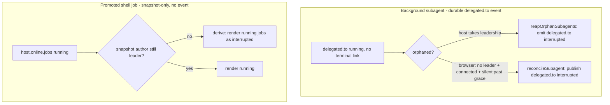

# Orphaned Background Reconcile - Implementation Plan

## 0. Hard Dependencies

- [x] **The turn-reconcile machinery this plan mirrors is already merged.** The
  browser side (`detectOrphanedTurn` `apps/web/src/derive.ts:757`,
  `reconcileTurn` `apps/web/src/session/use-session.ts:358`, wired via
  `reconciledRunRef` `apps/web/src/app.tsx:397`) and the host side
  (`reapExcept`/`terminalCompletion` `apps/agent-host/src/agent/turn-machine.ts:104,77`
  driven by `reapOrphans` `apps/agent-host/src/agent/run-lifecycle.ts:78` on
  leadership takeover `apps/agent-host/src/boot/leadership.ts:127,205`) ship today.
  This plan reuses their shape; it does not change the turn reconcile. <!-- D-001 -->
- [x] **The `delegated.to` lifecycle event already exists.** A background subagent
  publishes `delegated.to{status:"running"}` on start (`seedChildSession`
  `apps/agent-host/src/agent/delegate.ts:100`) and a terminal `done|failed` on
  fold-back (`foldBackLink` `apps/agent-host/src/agent/delegate.ts:116`). This plan
  widens its `status` enum but adds no new event. <!-- D-002 -->

No unmerged plan blocks this work. **Plan 45 (subagent-variants)** was considered:
its verifier subagent would ride this reconcile machinery for free if it ever runs
in the background, but plan 45 introduces no contract this plan depends on and does
not enumerate the `delegated.to` status union - considered, no coupling. See
*Related plans* below.

## Architecture

Background work started by a host can latch as "running" forever when the host that
owns its completion signal dies or churns before emitting it. In-flight *turns*
already have a two-sided reconcile for exactly this; background work does not. This
plan closes three gaps, mirroring the turn reconcile wherever a durable event exists
and falling back to a pure derive-layer fix where one does not.

Three kinds of orphaned background work, each with its own truth source:

1. **Background subagents** carry a durable lifecycle event (`delegated.to`) on the
   PARENT log. An orphaned subagent is a `delegated.to{status:"running"}` link with
   no terminal link for the same `childSessionId`. Because the event is durable, it
   can mirror the turn reconcile on BOTH sides. <!-- D-001 -->
2. **Promoted shell jobs** have NO durable per-job event. They exist only as a field
   on the latest `host.online` presence snapshot (`presence.ts:120`
   `supervisor.snapshots()`, surfaced by `jobsFrom` `derive.ts:348`). There is
   nothing to reap and no terminal event to emit, so jobs CANNOT mirror the
   reconcile - the only available truth is that the snapshot's author is no longer
   the live leader. This is a pure derive-layer presentation fix. <!-- D-003 -->
3. The reconcile carries a new terminal status, `"interrupted"`, so an orphan-reap
   stays distinguishable from a genuine failure (mirrors the turn's `interrupted`
   flag vs a real error). <!-- D-002 -->



### Key Constraints

| Constraint | Impact |
|-----------|--------|
| A background subagent OUTLIVES its spawning turn (`start-turn.ts:159` `backgroundChildren` registry). | Its terminal `delegated.to` can be lost independently of any turn reconcile, so it needs its own reap keyed by `childSessionId`, not `runId`. |
| The `delegated.to` decoder already coerces `status` with `str(p.status, "running")` (`protocol-decode.ts:816`). | A new `"interrupted"` string already survives decode at runtime; the widening is a TS-type + consumer change, not a wire change - old logs decode unchanged. |
| The transcript reducer advances one delegation block in place by `childSessionId` (`transcript.ts:633`). | A host reap and a browser reconcile for the same child both land on the same block, so duplicate terminal links converge on one card - the two sides are idempotent by key. |
| Jobs live ONLY on the `host.online` snapshot; there is no `job.*` event (D-003). | Jobs cannot publish a terminal event; the fix must live in the derivation that already reads host liveness (`hostStatus` `derive.ts:181-292`). |
| The browser reconcile must never fire while a leader is present (the turn invariant). | Both the subagent detector and the job downgrade gate on the SAME liveness verdict the turn path uses, so a live but slow host is never cut short. |

### Boundaries

- **Protocol owns the status vocabulary.** `packages/session` owns the widened
  `delegated.to` status union and its decode; the host and web consume it. The wire
  shape is unchanged (a string field), so no migration.
- **Host owns the reap-on-takeover.** The subagent reap derives orphaned links from
  the replayed PARENT log and excludes children THIS host is actively running (its
  live `backgroundChildren` keyset), exactly as `reapExcept(activeRunId)` excludes
  the live turn. It fires from the same two leadership hooks as `reapOrphans`.
- **Browser owns the last-resort reconcile.** `detectOrphanedSubagents` +
  `reconcileSubagent` mirror `detectOrphanedTurn` + `reconcileTurn`, guarded by a
  `reconciledSubagentRef` (mirror of `reconciledRunRef`) so each child is reconciled
  at most once and never while a leader is present.
- **Jobs stay presentation-only.** The job reconcile is a pure function of
  `(announcement, host-liveness)` in the derive layer; it emits nothing and adds no
  event. The kill control is inert for a reconciled job (its host is gone). <!-- D-003 -->
- **No subagent detail view and no subagent kill control** (out of scope, below).

### Observability

The reconcile is visible through the surfaces that already render this work, with no
new metric. A reaped subagent shows as an `interrupted` delegation card in the
transcript and drops out of `runningSubagents` in the support panel; a reconciled job
shows an `interrupted`/terminal tone in the support panel background rows instead of a
stuck "running". The host logs each subagent reap the same way `reapOrphans` logs a
turn reap (`log("host", "reaping orphaned subagent", { child })`), so an operator can
correlate a takeover with the links it closed. If the reconcile decision itself needs
deeper inspection later (e.g. in `/doctor`), that is a follow-up on the Doctor surface
owned by plan 41, not part of this cutoff.

## Non-Goals

- **No subagent DETAIL view.** A delegated child stays a single linked transcript
  card; this plan only advances its status. A drill-in inspector for subagents is
  explicitly out.
- **No durable job-event model.** Jobs stay presentation-only (D-003). This plan does
  NOT add a `job.*` event, a per-job log record, or a job reap on the host. If a
  durable job model is ever wanted, it is a separate plan.
- **No subagent kill control.** Jobs already have a kill affordance; subagents do not,
  and this plan does not add one. The reconcile closes an orphan; it does not offer to
  cancel a live child.
- **No change to the turn reconcile.** The turn path is the template, not the target.
  This plan reuses its shape and its liveness verdict; it does not modify
  `detectOrphanedTurn`, `reconcileTurn`, `reapExcept`, or `reapOrphans`.

## Phases

### Phase 1: The protocol seam

**Goal:** `delegated.to` can carry `status:"interrupted"` end to end - builder,
decoder, transcript reducer, and support-panel consumers all recognize it as a
terminal status - while every existing emit path still only produces
`running|done|failed` (behavior byte-identical until Phase 2 emits the new variant).

**Gate from previous:** none.

#### M1: Widen the `delegated.to` status enum with `interrupted`

- **Dependencies:** none
- **Effort:** S (1-2d)
- **Tasks:**
  1. RED: Add a protocol round-trip test asserting `delegatedTo({..., status:"interrupted"})` builds and decodes back to `"interrupted"` (pins the widened contract; the decoder already passes the string through via `str(p.status, "running")`). <!-- D-002 -->
  2. GREEN: Widen the `status` union to `"running" | "done" | "failed" | "interrupted"` on the `delegatedTo` builder (`protocol.ts:508`) and the decoded `DelegatedTo` type; keep the decoder default `"running"`.
  3. RED: Add a transcript-reducer test asserting a later `delegated.to{status:"interrupted"}` advances the EXISTING delegation block in place (same `childSessionId`) to `interrupted`, not spawning a second card (`transcript.ts:633`).
  4. GREEN: Confirm the reducer's in-place advance treats `interrupted` as a valid terminal status alongside `done|failed`.
  5. RED: Add a support-panel test asserting `runningSubagents` EXCLUDES an `interrupted` child (terminal, like done/failed) and `subagentRow` maps `interrupted` to an error/terminal tone with an `"interrupted"` status label (`support-panel.ts:114,124`).
  6. GREEN: Update `runningSubagents` (`status !== "done" && !== "failed" && !== "interrupted"`) and `subagentRow` tone/label for the new variant.
  7. REFACTOR: Introduce a single `isTerminalDelegationStatus` predicate reused by the reducer, `runningSubagents`, and `subagentRow`, so the three consumers cannot disagree on which statuses are terminal.

### Phase 2: Two-sided subagent reconcile

**Goal:** An orphaned background subagent (a `delegated.to{status:"running"}` link
whose owning host vanished before fold-back) is closed to `interrupted` on BOTH the
host takeover path and the browser last-resort path, keyed by `childSessionId`, and
the two converge on one terminal link. <!-- D-001 -->

**Gate from previous:** M1 merged - the `interrupted` status exists end to end.

#### M2: Browser-side subagent orphan auto-reconcile (mirror `reconcileTurn`)

- **Dependencies:** M1
- **Effort:** M (3-5d)
- **Tasks:**
  1. RED: Add a `derive.ts` unit test for `detectOrphanedSubagents(events, check)`: returns the `childSessionId`(s) of any `delegated.to{status:"running"}` link with no terminal link for the same child, when `!leaderPresent` + `connected` + silent past `graceMs`; returns none while a leader is present, while disconnected, within grace, or once a terminal link exists. <!-- D-001 -->
  2. GREEN: Implement `detectOrphanedSubagents` reusing the `OrphanCheck` inputs and the same `ORPHAN_GRACE_MS` / silent-past-grace logic as `detectOrphanedTurn`.
  3. RED: Add a `use-session` test asserting `reconcileSubagent(link)` publishes a terminal `delegated.to{status:"interrupted"}` keyed by that `childSessionId` (carrying the original `runId`/`agent`/`task`/`mode` so the reducer advances the existing block), with a recovery summary in `result`.
  4. GREEN: Add `reconcileSubagent` to `createSessionActions` (`use-session.ts`) mirroring `reconcileTurn`.
  5. RED: Add an app-wiring test asserting the orphan-subagent effect fires `reconcileSubagent` at most once per `childSessionId` (a `reconciledSubagentRef` Set guard mirroring `reconciledRunRef` `app.tsx:397`) and never while a leader is present.
  6. GREEN: Wire the detector -> action effect in `app.tsx` behind `reconciledSubagentRef`, alongside the existing `reconciledRunRef` turn path.
  7. REFACTOR: Factor the shared "no leader + connected + silent past grace" gate so the turn and subagent detectors read one predicate; keep the two public detectors thin.

#### M3: Host-side subagent reap on leadership takeover (mirror `reapExcept`)

- **Dependencies:** M1
- **Effort:** M (3-5d)
- **Tasks:**
  1. RED: Add a host test asserting that on taking leadership with an orphaned `delegated.to{status:"running"}` in the replayed parent log (no terminal link, NOT in this host's `backgroundChildren` registry), the host emits a terminal `delegated.to{status:"interrupted"}` for that child. <!-- D-001 -->
  2. GREEN: Add `reapOrphanSubagents()` alongside the turn reap (`run-lifecycle.ts:78`): derive orphaned running links from the log and emit terminal interrupted links, excluding children this host is actively running - the subagent analogue of `reapExcept(activeRunId)`.
  3. RED: Add a test asserting a subagent this host is ITSELF actively running (present in `backgroundChildren`) is NOT reaped.
  4. GREEN: Thread the live `backgroundChildren` keyset into the reap as the exclusion set (`start-turn.ts:159` / `main.ts` registry).
  5. RED: Add a test asserting idempotency - a second takeover after the interrupted link is already in the log emits nothing further.
  6. GREEN: Ensure the log-derived orphan scan treats ANY terminal status (`done|failed|interrupted`) as closing the link.
  7. REFACTOR: Call `reapOrphanSubagents()` from the SAME two leadership hooks as `reapOrphans()` (`boot/leadership.ts:127` `onBecomeLeader` + `:205` `goLive` reconnect) so the turn and subagent reaps share one takeover trigger.

### Phase 3: Jobs derive-layer reconcile and end-to-end verification

**Goal:** A dead host's `running` jobs render as terminal/interrupted (pure
derivation, no event), and the full orphaned-background picture - subagent + job -
settles to "no background work running" after reconcile, on both sides, without
duplicates.

**Gate from previous:** M2 + M3 merged - subagents reconcile on both sides.

#### M4: Promoted shell jobs - derive-layer reconcile of a stale snapshot

- **Dependencies:** none (protocol untouched; independent of M1-M3)
- **Effort:** S (1-2d)
- **Tasks:**
  1. RED: Add a `derive.ts` test asserting the jobs derivation renders a `running` job as terminal/interrupted when the latched `host.online` came from a host that is no longer the live leader (`hostStatus.leaderId` differs / not present `derive.ts:181-292`), and leaves jobs `running` when the snapshot's author is still the leader. <!-- D-003 -->
  2. GREEN: Implement the reconcile in the derivation: pass the host-liveness verdict computed by `hostStatus` into the jobs derivation (`jobsFrom` `derive.ts:348`) and downgrade `running` jobs to interrupted when the snapshot's author is not the live leader. No new event.
  3. RED: Add a `support-panel` test asserting `jobRow`/`jobOutcome` render a reconciled job with an interrupted/terminal tone + label (not "running"), and `jobToDetailModel` reflects the terminal status (`support-panel.ts:82-148`).
  4. GREEN: Ensure the reconciled status flows through `jobOutcome`/`jobRow` so the panel shows terminal, and the existing job kill control (`support-panel-view.tsx`) is inert for a reconciled job (its host is gone - nothing to kill).
  5. REFACTOR: Keep the reconcile pure and presentation-only - one place computes "snapshot author is stale," reused by the jobs derivation; no new event, no host change.

#### M5: End-to-end orphan reconcile verification and consolidation

- **Dependencies:** M2, M3, M4
- **Effort:** M (3-5d)
- **Tasks:**
  1. RED: Add an integration test (hermetic host lane) that starts a background subagent, drops the leader mid-flight (no fold-back), takes leadership on a second host, and asserts exactly ONE terminal `delegated.to{status:"interrupted"}` lands for the child - no duplicate when a browser also observes the gap.
  2. GREEN: Confirm the two paths converge: the reducer's in-place advance keyed by `childSessionId` + idempotent terminal keys dedupe a host reap and a browser reconcile onto one card; pin it.
  3. RED: Add a derive/UI test asserting a session whose only in-flight background work is an orphaned subagent AND a dead-host running job settles to "no background work running" after reconcile (the support panel shows neither as running).
  4. GREEN: Confirm the support-panel background rows reflect both reconciles together.
  5. REFACTOR: Consolidate the orphan-reconcile surface - one documented `ORPHAN_GRACE_MS`, one silent-past-grace predicate shared by the turn + subagent detectors, and a module comment on the reap path naming the three reconciled kinds (turn, subagent, job) and why jobs differ (presentation-only, D-003).

### Gate 3 (exit)

- [ ] All Phase 1-3 milestone tests pass.
- [ ] A background subagent orphaned by a host crash reaches `interrupted` on host takeover AND on a browser with no leader, with no duplicate card.
- [ ] A dead host's `running` jobs render terminal in the support panel; a live leader's jobs still render `running`.
- [ ] The turn reconcile is unchanged (its tests still pass byte-identical).

---

## Risk Register

| Risk | Severity | Likelihood | Mitigation | Owner |
|------|----------|------------|------------|-------|
| Browser reconcile fires while a host is merely mid-reconnect, racing the host reap. | medium | medium | Same conservative gate as `detectOrphanedTurn`: only after `ORPHAN_GRACE_MS` of silence with no leader; the host gets first crack. Terminal links are idempotent by `childSessionId`, so a race converges on one card. | web |
| A subagent this host is legitimately running is reaped as an orphan on takeover. | high | low | Exclude the live `backgroundChildren` keyset, exactly as `reapExcept` excludes the active run. M3 RED pins the exclusion. | host |
| Job downgrade misreads a live leader's snapshot as stale (false "interrupted"). | medium | low | The downgrade reuses `hostStatus`'s existing leader/liveness verdict (the same one the turn path trusts); it never invents its own liveness check. | web |
| Widening the status enum breaks an exhaustive `switch` on `delegated.to` status. | low | medium | The compiler surfaces every non-exhaustive consumer; M1 GREEN updates them and adds `isTerminalDelegationStatus` so future consumers share one classifier. | protocol |

---

## Escape Hatches

1. **If the browser reconcile proves flaky under reconnect races:** ship the host-side
   reap (M3) alone - it already closes the common case (host crash + failover) - and
   gate the browser path (M2) behind the same maturity bar `detectOrphanedTurn` cleared.
2. **If the job derive fix surfaces false positives:** the job downgrade is pure and
   isolated (M4); it can be reverted independently of the subagent reconcile without
   touching the protocol or the host.

---

## Progress Report Accounting

The progress report is the implementation resume state and uses normalized accounting,
not raw checkbox counts:

- current-cutoff blockers count only active unchecked work;
- there is no deferred/superseded bucket yet (new plan, nothing rebaselined);
- the current focus marker matches the first unchecked current-cutoff checkbox.

Before resuming implementation or declaring convergence, run:

```bash
mise x node@22 -- npx tsx ~/.agents/skills/planner/scripts/plan-db.ts check-progress --plan "52-orphaned-background-reconcile"
```

---

## Validation Commands

```bash
# Discovered during exploration; run from the repo root.
pnpm --filter @trevor/session test        # protocol builder + decoder (M1)
pnpm --filter @trevor/web test            # derive + use-session + support-panel + app wiring (M1, M2, M4, M5)
pnpm --filter @trevor/agent-host test     # reap-on-takeover + hermetic lane (M3, M5)
```

---

## Related plans

- **Plan 45 (subagent-variants):** considered, no coupling. Its verifier subagent
  would inherit this reconcile machinery for free IF it runs in the background, but
  plan 45 is scoped to adversarial-review behavior, does not enumerate the
  `delegated.to` status union, and depends on nothing this plan changes. No forward
  dependency threaded.
- Plan 52 is the highest-numbered plan; no later plan is implemented after it, so
  there is no downstream plan to accommodate.

---

## Decisions

Canonical decisions are in `.plans/52-orphaned-background-reconcile/plan.db`.

- **D-001** Background subagents mirror the turn reconcile - two-sided (host reap on
  takeover + browser last-resort), keyed by `childSessionId`.
- **D-002** Widen the `delegated.to` status enum with `interrupted` so an orphan-reap
  is distinguishable from a real failure.
- **D-003** Promoted shell jobs are a derive-layer presentation fix, NOT an event -
  a dead host's snapshot renders its `running` jobs as interrupted.

Query with:

```bash
mise x node@22 -- npx tsx ~/.agents/skills/planner/scripts/plan-db.ts query-decisions --plan "52-orphaned-background-reconcile"
```
