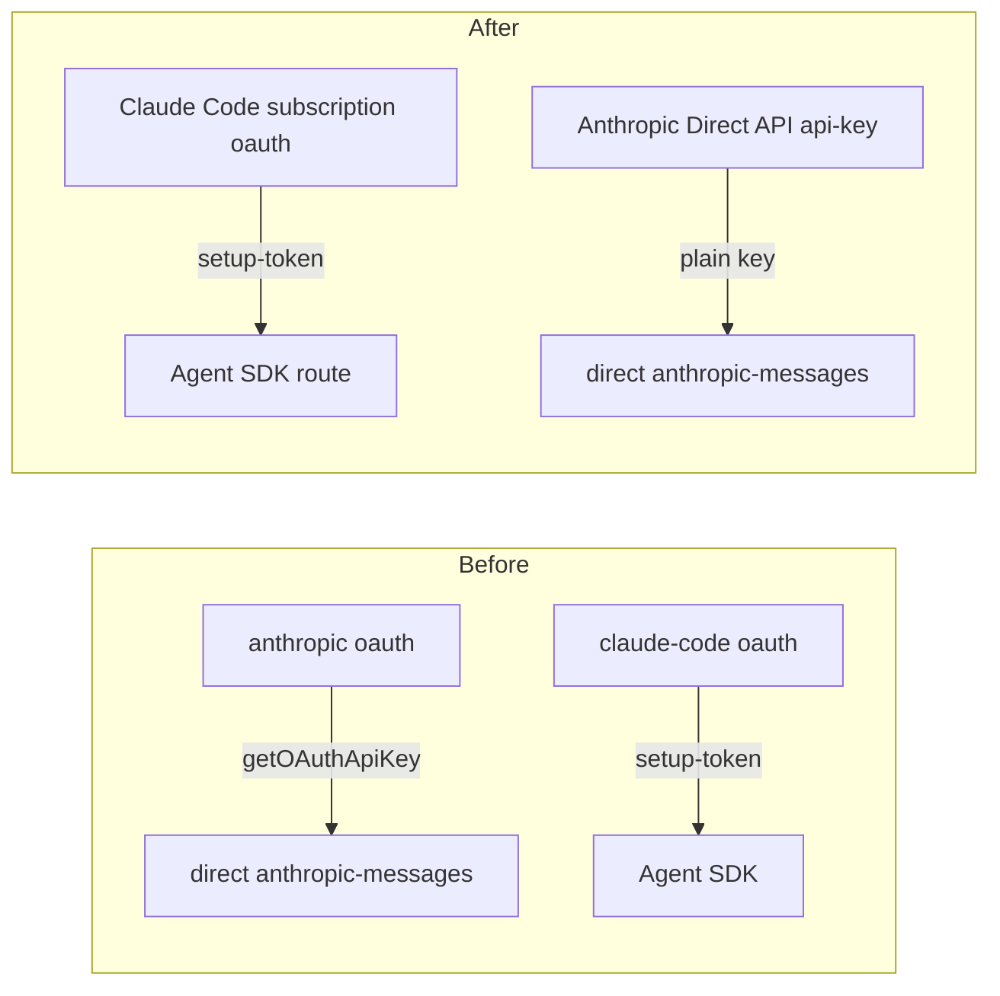

# Claude / Anthropic Source Auth — Implementation Plan

## 0. Hard Dependencies

None blocking. This plan edits the host source registry
(`apps/agent-host/src/providers/catalog.ts`) and two web chooser files
(`apps/web/src/app.tsx`, `apps/web/src/components/chooser/source-auth-panel.tsx`);
the contracts it needs already exist:

- [x] **The `SourceType` and `SourceAction` unions already cover this work.**
  `SourceType = "local" | "oauth" | "gateway" | "api-key"` and
  `SourceAction = "authenticate" | "reauthenticate" | "refresh" | "configure" | "disable"`
  both live in `packages/session/src/model-source.ts` (lines 24, 39). The merged
  subscription is `oauth`, the new direct API is `api-key`, and `configure` is
  already a valid action the catalog emits — so no protocol/contract migration is
  needed, only registry + dispatch + one web handler + one layout fix. <!-- D-003 -->
- [x] **The catalog is host-owned and the chooser is presentational.**
  `buildCatalogSnapshot` (catalog.ts:331) is the single owner of which sources exist
  and their actions; the chooser (`model-chooser.tsx`) renders `SourceSummary` rows
  grouped by `SourceType` (its `SECTIONS`, lines 50-56) and never hardcodes a source
  list. Removing/adding a `SourceDef` row automatically re-groups the chooser with no
  web change beyond the two gaps this plan closes. <!-- D-001 -->

No unmerged plan blocks this work.

## Architecture

The model chooser shows two OAuth "Claude" sources that are the same subscription
split in two, plus a dead source action and a layout overflow. The host source
registry `SOURCES` (`apps/agent-host/src/providers/catalog.ts:66-125`) is the single
owner of what exists:

- The `anthropic` source (catalog.ts:76-81, `type: "oauth"`, label "Anthropic
  (Claude)", `oauthName: "anthropic"`) dispatches to `anthropicProvider`
  (`anthropic.ts`): its OAuth token is resolved to an API key by pi-ai
  (`getOAuthApiKey`, `provider-auth.ts:78`) and hits the DIRECT `anthropic-messages`
  API.
- The `claude-code` source (catalog.ts:86-93, `type: "oauth"`, `CLAUDE_CODE_SOURCE_ID`,
  `cliTokenEnv: CLAUDE_CODE_OAUTH_ENV`, `toolCapable: false`) dispatches to
  `claudeCodeProvider` (`claude-code.ts`): the Max-plan subscription via the long-lived
  `claude setup-token` token, routed through `@anthropic-ai/claude-agent-sdk`.

The corrected billing model (the authoritative account explanation): there is ONE
Anthropic OAuth. The Claude subscription is a SINGLE subscription — the same token
works whether routed to the direct API or the SDK; whether a route is *accepted*
depends on the account's usage-charge setting. For subscription-only accounts (usage
charges off) the direct API rejects it and the SDK works; with usage charges on the
direct route is accepted. The Anthropic *API* is a SEPARATE product: a plain generated
API key (NOT OAuth), usage-billed.

This plan makes the registry reflect that:



- **D-001:** Collapse `anthropic` + `claude-code` into ONE "Claude Code subscription"
  source under the "Cloud subscriptions" (oauth) category — one subscription, one
  sign-in. The surviving row is `CLAUDE_CODE_SOURCE_ID`; the SDK/`setup-token`
  credential is the subscription's credential. It may route via the SDK (the working
  path when usage charges are off) or the direct API (accepted only when usage charges
  are enabled). <!-- D-001 -->
- **D-002:** Add a SEPARATE "Anthropic Direct API" source of `type: "api-key"` under
  the "Direct API" category (peer to DeepSeek / Z.ai / MiniMax) taking a plain
  generated key — NOT OAuth. It derives from a `PI_KEY_PROVIDERS` row (piProvider
  `anthropic`, a static `{ key }` auth entry) exactly like the other direct API-key
  sources, so `providerForSource` builds it through `piKeyProviderFromConfig`
  (catalog.ts:422-434). The OAuth-mints-a-key-for-the-direct-API path
  (`anthropicProvider` + the `anthropic` `SIGN_IN_TARGETS` entry) is removed. <!-- D-002 -->
- **D-003:** Wire the dead source action. `onSourceAction` (`app.tsx:973-982`) only
  handles `refresh | authenticate | reauthenticate`; there is NO `configure` branch, so
  the button does nothing on any machine. Add a `configure` branch so the Direct-API
  "Configure" and the subscription sign-in both surface the host auth-store setup
  guidance. No secret is ever entered in the chooser. <!-- D-003 -->
- **D-004:** Fix the auth-URL overflow in `source-auth-panel.tsx` (the `DeviceCodeFlow`
  verification URL, ~lines 150-170, rendered inline without wrapping), applying the
  repo's pixel-perfect standard. <!-- D-004 -->

### Key Constraints

| Constraint | Impact |
|-----------|--------|
| `configure` is already in the `SourceAction` union and the catalog already emits it for a `cliTokenEnv` oauth source and an unconfigured api-key source (catalog.ts:366-371). | The dead-action fix is purely the App-side handler; no protocol/contract change. |
| The subscription's credential is the `setup-token` (SDK route), a DIFFERENT store than `~/.pi/auth.json`. | Collapsing to one source keeps the setup-token as the sole credential; the direct-API route *via the subscription OAuth* is deferred (open item), not this cutoff's blocker. |
| The chooser is presentational over host read models; `SECTIONS` groups by `SourceType` and never hardcodes a source list. | Removing the `anthropic` row and adding the api-key row re-groups the chooser automatically — no web change beyond the handler + the overflow fix. |
| No new `SourceType` / `SourceAction` is required (oauth, api-key, and `configure` already exist). | The change is registry + dispatch + one web handler + one CSS fix, not a contract migration. |
| The auth panel renders guidance only, never an API-key field (existing no-secret invariant, `source-auth-panel.tsx` doc-comment). | The `configure` branch surfaces guidance; it never introduces a paste form. The invariant is preserved, not changed. |

### Boundaries

- **Host owns the source set and dispatch.** `catalog.ts` collapses the two Claude
  rows to one and adds the direct-API peer; `providerForSource` (catalog.ts:384-436)
  routes the merged source through `claudeCodeProvider` and the direct-API source
  through `piKeyProviderFromConfig`. The web is never told which route serves the
  subscription.
- **Web owns rendering + action forwarding only.** The chooser already forwards
  `source.actions`; the one web gap on the action path is the missing `configure`
  branch in the App handler, and the one gap on the layout path is the URL overflow.
- **No secret enters the chooser.** The subscription uses `claude setup-token` (host
  CLI); the direct API uses a `~/.pi/auth.json` key. The `configure` action opens
  guidance, never a key field. <!-- D-003 -->
- **Removing the OAuth-mints-a-key path is a clean deletion.** `anthropic.ts`, the
  `anthropic` `SourceDef` row, and the `anthropic` `SIGN_IN_TARGETS` entry
  (`provider-auth.ts:150-153`) all leave together; the direct API is a plain static-key
  peer afterward, with nothing left importing the removed provider. <!-- D-002 -->

### Observability

No new runtime/transport behavior — the catalog snapshot is the observable surface.
After the change a merged subscription shows ONE oauth row with one status, and the
direct API shows a SEPARATE api-key row. `/doctor`'s provider facts (owned by plan 41)
already enumerate the configured providers, so the collapse and the new peer are
visible there without a new metric. Streaming failures still ride the shared
provider-failure normalizer (redacted), unchanged. No new span or event is required.

## Non-Goals

- **No model favorites / default.** That is plan 51 (`51-model-favorites-and-default`).
- **No orphaned-background reconcile.** That is plan 52 (`52-orphaned-background-reconcile`).
- **No OpenAI / other source changes.** Only the two Claude sources and the one direct
  Anthropic API source are touched.
- **No account / billing changes on Anthropic's side.** This plan re-shapes how the
  existing subscription and API key are *presented and dispatched*, not the account.
- **No subscription→direct-API route in this cutoff.** The merged subscription ships
  routing via the SDK (the working path when usage charges are off). Whether/how the
  direct-API route via the subscription OAuth is surfaced (gated on usage charges) is an
  open item finalized during implementation, not a blocker for the collapse.
- **No key paste form in the chooser.** The host-owned auth-store invariant is
  preserved; `configure` surfaces guidance, it does not add a key field.

## Phases

### Phase 1: Consolidate the host source registry

**Goal:** The host exposes ONE Claude subscription source (oauth, setup-token/SDK) and
ONE Anthropic Direct API source (api-key, plain key); the OAuth-mints-a-key path is
gone. The chooser re-groups automatically because it is presentational.

**Gate from previous:** none.

#### M1: Collapse the two Claude OAuth sources into one subscription source

- **Dependencies:** none
- **Effort:** M (3-5d)
- **Tasks:**
  1. RED: Add a `buildCatalogSnapshot` unit test asserting exactly ONE Claude source under the oauth ("Cloud subscriptions") family — id `claude-code`, label "Claude Code subscription" — and that the separate `anthropic` oauth source is gone.
  2. GREEN: Remove the `anthropic` oauth `SourceDef` row from `SOURCES` (catalog.ts:76-81) and relabel the surviving `CLAUDE_CODE_SOURCE_ID` row to "Claude Code subscription"; keep its `cliTokenEnv` (setup-token) configured signal and `toolCapable: false`. <!-- D-001 -->
  3. RED: Add a `providerForSource` test asserting the merged subscription source dispatches to the SDK provider (`claudeCodeProvider`), billed to the setup-token, for a Claude model id.
  4. GREEN: Ensure `providerForSource` (catalog.ts:384-436) routes the merged source through `claudeCodeProvider`; drop the `source.sourceId === "anthropic"` → `anthropicProvider` branch (catalog.ts:399-401).
  5. RED: Add a snapshot test asserting the merged source's configured signal is the setup-token env (`cliTokenPresent`) so its action projects to `configure` (not the device-code `authenticate`).
  6. GREEN: Confirm the actions projection (catalog.ts:366-371) yields `configure` for the merged source (it already does for a `cliTokenEnv` oauth source).
  7. REFACTOR: Delete the orphaned `anthropic`-source comments and update the module doc-comment so the registry describes ONE Claude subscription, not two.

#### M2: Add the Anthropic Direct API (api-key) source; remove the OAuth-mints-a-key path

- **Dependencies:** M1
- **Effort:** M (3-5d)
- **Tasks:**
  1. RED: Add a `buildCatalogSnapshot` test asserting a new `api-key` source "Anthropic Direct API" appears under the Direct API family (peer to DeepSeek / Z.ai / MiniMax), with a static-key configured signal (`{ key }` presence) and NO OAuth/device-code action.
  2. GREEN: Add the Anthropic Direct API as a `PI_KEY_PROVIDERS` row (`pi-key.ts`, piProvider `anthropic`, a static `{ key }` auth entry — e.g. `anthropic-api` to avoid colliding with any legacy OAuth entry) so the api-key source and roster provider derive from one registry row. <!-- D-002 -->
  3. RED: Add a `providerForSource` test asserting the new source dispatches to the static-key pi provider (`piKeyProviderFromConfig`) hitting the direct `anthropic-messages` API with a plain key — never `getOAuthApiKey`.
  4. GREEN: Confirm the api-key dispatch branch (catalog.ts:422-434) builds the Anthropic direct provider from the registry row.
  5. RED: Add a test asserting the OAuth-mints-a-key path is gone: `signInTargetFor("anthropic")` returns null and no `anthropicProvider`/`oauthCredentialResolver({ oauthName: "anthropic" })` provider is constructible.
  6. GREEN: Delete `anthropic.ts` (the OAuth→direct provider), remove its import from catalog.ts, and remove the `anthropic` entry from `SIGN_IN_TARGETS` (provider-auth.ts:150-153) with its `anthropicLogin` helper.
  7. REFACTOR: Sweep dangling imports/exports and any roster references so the direct API is a clean api-key peer with nothing left pointing at the removed OAuth provider.

### Gate 1→2

- [ ] All Phase 1 catalog + provider tests pass.
- [ ] `buildCatalogSnapshot` reports exactly one oauth Claude source and one api-key Anthropic source.
- [ ] No symbol still imports `anthropicProvider` or the `anthropic` sign-in target.

### Phase 2: Chooser wiring and pixel pass (web, Storybook-first)

**Goal:** The `configure` source action is wired end to end (no dead button), and the
auth-URL no longer overflows. Both are built Storybook-first over the host read models.

**Gate from previous:** Phase 1 merged — the source set is final, so the chooser groups
and actions are stable.

#### M3: Wire the dead `configure` source action

- **Dependencies:** M1, M2
- **Effort:** S (1-2d)
- **Tasks:**
  1. RED: Add a `SourceAuthPanel` / `ModelChooser` story (or interaction test) for an api-key source needing setup, asserting the "Configure" button invokes `onSourceAction(sourceId, "configure")`.
  2. GREEN: Confirm the chooser already forwards `configure` (it renders `source.actions` and calls `onSourceAction` — model-chooser.tsx:436, 470); the gap is the App handler, not the chooser.
  3. RED: Add an `app.tsx` handler test asserting `onSourceAction(id, "configure")` surfaces the host auth-store setup guidance (the source's `SourceAuthPanel` guidance) instead of no-op-ing, for BOTH the Direct-API source and the subscription source. <!-- D-003 -->
  4. GREEN: Add the `configure` branch to `onSourceAction` (app.tsx:973-982): open/keep the source detail's setup guidance (the `SourceAuthPanel`, which already renders the host-store copy) — never a paste form. The subscription source's `configure` shows the `claude setup-token` guidance; the Direct-API source's shows the `~/.pi/auth.json` key guidance.
  5. RED: Add a test asserting no source action is a silent no-op — every action a source can offer (`refresh | authenticate | reauthenticate | configure`) triggers a defined effect.
  6. REFACTOR: Make the handler enumerate the `SourceAction` union exhaustively (a compile-time exhaustiveness guard), so a future action can't silently no-op again.

#### M4: Fix the auth-URL overflow and pixel pass

- **Dependencies:** none
- **Effort:** S (1-2d)
- **Tasks:**
  1. RED: Add a `source-auth-panel.stories.tsx` fixture with a very long verification URL (device-code flow) and a test/story assertion that the panel does not overflow its container horizontally (the URL wraps, or scrolls within an `overflow-x-auto` container).
  2. GREEN: Apply the fix to the URL anchor block (source-auth-panel.tsx:155-170): `break-all` / wrapping or an `overflow-x-auto` container, keeping the external-link icon aligned. <!-- D-004 -->
  3. RED: Add an assertion that the link + short code-chip row stays within bounds at a narrow container width (container-query / narrow viewport).
  4. GREEN: Adjust the flex row so the long link and the short code chip lay out without pushing past the panel edge.
  5. REFACTOR: Pixel pass on the panel per the repo's pixel-perfect standard — spacing, alignment, the wrapped-URL affordance — and confirm it reads consistently in light and dark.

## Open Questions

- **Subscription credential mechanics.** The `setup-token` drives the SDK route; whether
  and how the direct-API route *via the subscription OAuth* is surfaced (gated on the
  account's usage-charge setting) and exactly what Anthropic's consent screen offers are
  finalized during implementation — the account owner confirms against their own account.
  This is not a blocker: the merged source ships routing via the SDK. <!-- D-001 -->
- **Direct-API auth entry name.** Whether the new api-key source reuses `anthropic` or a
  distinct `~/.pi/auth.json` entry (e.g. `anthropic-api`) is chosen during M2 GREEN to
  avoid colliding with any legacy OAuth entry named `anthropic`. <!-- D-002 -->
- **Subscription `toolCapable` shape.** The merged source inherits `claude-code`'s
  current text-only shape (`toolCapable: false`) for this cutoff; revisiting it if/when
  the direct-API route is enabled is out of scope here.

## Validation Commands

```bash
# Host: catalog + provider unit tests (project-specific runner discovered during exploration)
pnpm --filter @trevor/agent-host test
# Web: chooser + auth-panel stories / tests
pnpm --filter @trevor/web test
```

## Decisions

Canonical decisions are in the plan database (`.plans/53-claude-anthropic-source-auth/plan.db`).
Query with:

```bash
mise x node@22 -- npx tsx ~/.agents/skills/planner/scripts/plan-db.ts query-decisions --plan "53-claude-anthropic-source-auth"
```

- **D-001** Collapse the two Claude OAuth sources into one "Claude Code subscription" (oauth, setup-token/SDK credential).
- **D-002** Add a separate "Anthropic Direct API" api-key source (plain key); remove the OAuth-mints-a-key-for-the-direct-API path.
- **D-003** Wire the dead `configure` source action so the Direct-API Configure and the subscription sign-in surface host auth-store guidance.
- **D-004** Fix the auth-URL horizontal overflow in `source-auth-panel.tsx`, pixel-perfect.
