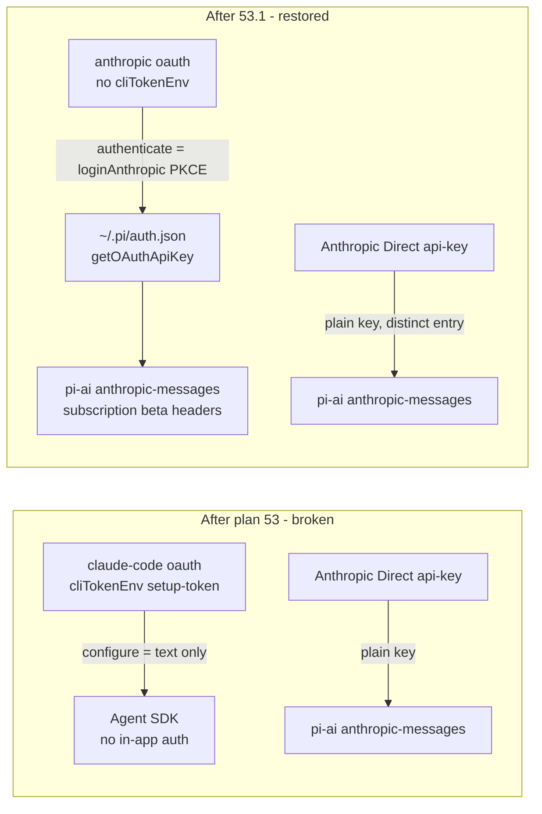

# 53.1 Claude Subscription Sign-In — Implementation Plan

Restore a working **in-app OAuth sign-in** for the single Claude subscription source.
Plan 53 collapsed the two Claude OAuth rows into one (good) but kept the
`setup-token` / Agent-SDK survivor and **deleted the pi-ai OAuth path** — leaving a
source with no in-app auth (its "Configure" button only prints `claude setup-token`
guidance and opens no browser). This plan puts the survivor back on the credential that
actually works: the pi-ai `loginAnthropic` browser flow that V1 (`~/dev/trevor`) has
always used and the account owner confirms did it correctly.

## 0. Hard Dependencies

None blocking. This is a **partial revert of plan 53** (feature commit `3eadde0`, merged
to `main`; the plan dir was removed in `5f418da`, recoverable from
`5f418da^:.plans/53-claude-anthropic-source-auth/`). It edits the same host provider +
web chooser files plan 53 touched; every contract it needs already exists:

- [x] **The `SourceType` / `SourceAction` unions already cover this work.** The single
  Claude source stays `type: "oauth"`; dropping its `cliTokenEnv` flips its projected
  action from `configure` to `authenticate` through the *existing* actions rule
  (`catalog.ts:360-364`) — no protocol/contract change. <!-- D-001 -->
- [x] **`loginAnthropic` is present in the installed pi-ai.** The Claude Pro/Max OAuth
  (authorization-code + PKCE) ships at
  `@earendil-works/pi-ai/oauth` (`loginAnthropic`, `refreshAnthropicToken`,
  `anthropicOAuthProvider`); pi-ai's anthropic provider auto-detects the resolved
  `sk-ant-oat` OAuth token and streams it on the **subscription** path (Bearer +
  `oauth-2025-04-20` / `claude-code-20250219` beta headers, `x-api-key: null`). <!-- D-001 -->
- [x] **The api-key Direct API peer already uses a distinct auth entry.** `3eadde0`
  added `piKeyAuthName(def)` precisely so Anthropic Direct reads a **separate**
  `~/.pi/auth.json` entry — so restoring the `anthropic` OAuth entry does not collide
  with the Direct API key. <!-- D-003 -->

**Forward dependency this plan creates:** plan **44.4 (usage-limit-events)**, not yet
implemented, captures Claude rate-limit from the Agent-SDK `SDKRateLimitEvent` in
`claude-code.ts`. This plan deletes that file, so 44.4 is re-threaded onto the pi-ai
HTTP header path in the same change set (see [§ Downstream](#downstream-plan-444)). <!-- D-005 -->

## Architecture

Plan 53's premise held — there is **one** Anthropic OAuth and the two Claude rows were
redundant — but it kept the wrong survivor. The `claude-code` row streams through
`@anthropic-ai/claude-agent-sdk` billed to a `claude setup-token` env var, and it has
**no in-app sign-in**: its configured signal is a CLI-token env (`cliTokenEnv`), so its
action projects to `configure`, which only surfaces "run `claude setup-token`" text.
The row that *did* have a working in-app browser flow — `anthropic`
(`anthropicProvider` + the `anthropic` `SIGN_IN_TARGETS` entry via `loginAnthropic`) —
was deleted as "the OAuth-mints-a-key path" (53 D-002).

This plan restores that path as **the** single Claude subscription source and retires
the Agent-SDK route:



- **D-001:** The single Claude subscription source is `sourceId: "anthropic"`, label
  **"Claude subscription"**, `type: "oauth"`, `oauthName: "anthropic"`, **no**
  `cliTokenEnv`. Its action projects to `authenticate` → the chooser renders a real
  **"Sign in"** button that runs the host-owned `loginAnthropic` browser PKCE flow,
  writes `{type:"oauth"}` creds to `~/.pi/auth.json`, and streams via `anthropicProvider`
  (`getOAuthApiKey` → pi-ai `anthropic-messages`, subscription beta headers). Restores
  `anthropic.ts` and the `anthropic` `SIGN_IN_TARGETS` entry deleted in `3eadde0`. <!-- D-001 -->
- **D-002:** Retire the `setup-token` / Agent-SDK route. Delete `claude-code.ts` (+ its
  test), drop the `CLAUDE_CODE_SOURCE_ID` dispatch branch in `providerForSource` and the
  `cliTokenEnv` configured-signal branch for this source. Keeps plan 53's **one Claude
  row**, now on the working credential. <!-- D-002 -->
- **D-003:** The **Anthropic Direct API** stays a separate `api-key` peer, keyed on a
  **distinct** `~/.pi/auth.json` entry (`piKeyAuthName`, e.g. `anthropic-api`) so it never
  collides with the restored `anthropic` OAuth entry. No in-browser key field; the
  `source-auth-panel` copy for api-key sources reads "add your key to `~/.pi/auth.json`",
  never sign-in framing. Preserves the no-secret-in-browser boundary (53 D-003 / D-065). <!-- D-003 -->
- **D-004:** Ship the OAuth route accepting a known **account-dependent** risk: plan 53's
  billing model claimed the OAuth-token→Messages-API route is *rejected* for
  subscription-only accounts (usage charges off). V1 runs pi-ai with the subscription beta
  headers and it works, and the account owner confirms the old `anthropic` source worked;
  `claude setup-token` remains the documented escape hatch if a given account rejects it. <!-- D-004 -->

### Key Constraints

| Constraint | Impact |
|-----------|--------|
| The actions rule already emits `authenticate` for an oauth source **without** `cliTokenEnv` (`catalog.ts:360-364`). | Restoring `anthropic` as a plain oauth source (no `cliTokenEnv`) flips its button to "Sign in" for free; no web action wiring changes. |
| `signInSource` / the `sign-in` App command already exist (`app.tsx:1145-1147`, `source-action.ts`). | The web already runs a source's sign-in; the only reason Claude had no browser flow was the missing host `SIGN_IN_TARGETS` entry — a host-only gap. |
| After this change **no** oauth source carries `cliTokenEnv`, so no oauth source ever projects `configure`. | The `authCopy` oauth `configure` special-case (`source-auth-panel.tsx:97-101`) becomes dead code and is removed; `configure` now only means api-key/gateway/local guidance. |
| `piKeyAuthName` already gives Anthropic Direct a distinct auth entry (`3eadde0`). | Restoring the `anthropic` OAuth entry in `~/.pi/auth.json` does not collide with the Direct API key; the two Anthropic rows own separate credentials. |
| `loginAnthropic` runs a Node `http` localhost callback server (CLI-only, not browser). | Correct for Trevor: the **host** (a Node process) runs the callback + emits the auth URL to the web via the existing `SourceSignInState` (`device-code` phase). The browser only opens the URL and, on a busy port, pastes the code back — the existing `DeviceCodeFlow` panel. |

### Boundaries

- **Host owns the source set, the credential, and the sign-in flow.** `catalog.ts`
  swaps the `claude-code` row for the `anthropic` row and routes it through
  `anthropicProvider`; `provider-auth.ts` restores `anthropicLogin` +
  `SIGN_IN_TARGETS["anthropic"]`. The web is never told which route serves the source.
- **Web owns rendering + action forwarding only.** No new web action path — the chooser
  already forwards `authenticate` and the App already maps it to `signInSource`. The web
  edits are: remove the dead oauth-`configure` copy branch, refine the api-key copy, keep
  the 53 D-004 overflow fix, and update tests/stories.
- **Retiring the Agent SDK route is a clean deletion.** `claude-code.ts`, its test, the
  `CLAUDE_CODE_SOURCE_ID` dispatch branch, and the `cliTokenEnv` signal for this source
  leave together; nothing else imports `claudeCodeProvider` after 44.4 is re-threaded.
- **The Direct API peer is untouched except its copy** — it remains a static-key pi
  provider on a distinct auth entry.

### Observability

No new runtime span/event. The observable surface is the catalog snapshot + the existing
`SourceSignInState` phases (`device-code` / `complete` / `error` / `cancelled`) the host
already emits during `runSourceSignIn`, which now fire for the Claude source too. A
sign-in failure rides the same redacted provider-failure normalizer, unchanged.
`/doctor`'s provider facts (plan 41) enumerate configured providers, so the restored
`anthropic` oauth row + the Direct API api-key row remain visible there without a new
metric.

## Non-Goals

- **No change to OpenAI/Codex or any non-Claude source.** Only the Claude subscription
  row, the restored `anthropic` provider, and the Direct API copy are touched.
- **No in-browser API-key field.** The no-secret boundary is preserved; the Direct API
  keeps `~/.pi/auth.json` guidance (user Q2). <!-- D-003 -->
- **No account/billing change on Anthropic's side.** This re-shapes how the existing
  subscription is authenticated and dispatched, not the account.
- **No `assistant.limit` work.** That is plan 44.4; this plan only re-threads 44.4's
  Claude capture source so it is not left against deleted code. <!-- D-005 -->
- **No new model favorites migration.** Favorites keyed on the retired `claude-code`
  source id silently no-op (the id no longer exists); re-favoriting on the `anthropic`
  row is a one-click user action, not a migration this plan builds.

## Phases

### Phase 1: Host — restore the OAuth route, retire the SDK route

**Goal:** The host exposes ONE Claude subscription source (`anthropic`, oauth,
`loginAnthropic` sign-in, pi-ai streaming) and the Direct API api-key peer; the
`setup-token`/Agent-SDK route is gone.

**Gate from previous:** none.

#### M1: Restore the pi-ai Anthropic OAuth provider + sign-in target

- **Dependencies:** none
- **Effort:** M (3-5d)
- **Tasks:**
  1. RED: Add a `provider-auth` test asserting `signInTargetFor("anthropic")` returns a
     target whose `oauthName` is `"anthropic"` and whose `login` drives `loginAnthropic`
     (seam injected) — today it returns `null`.
  2. GREEN: Restore `anthropicLogin` (adapting `loginAnthropic`'s `onAuth`/`onManualCodeInput`
     to the host `LoginCallbacks` `onAuthUrl`/`requestCode`) and re-add
     `anthropic: { oauthName: "anthropic", login: anthropicLogin }` to `SIGN_IN_TARGETS`
     (`provider-auth.ts`). <!-- D-001 -->
  3. RED: Add an `anthropicProvider` test asserting it builds a pi-ai provider on the
     `anthropic` registry with the `oauthCredentialResolver({ oauthName: "anthropic" })`
     strategy (mirrors the recovered `anthropic.test` shape).
  4. GREEN: Restore `apps/agent-host/src/providers/anthropic.ts` from
     `3eadde0^:apps/agent-host/src/providers/anthropic.ts` (loginAnthropic →
     `~/.pi/auth.json` → `getOAuthApiKey` → pi-ai `anthropic-messages`). <!-- D-001 -->
  5. REFACTOR: Update the module doc-comments so `anthropic.ts` describes the ONE Claude
     subscription (OAuth, pi-ai) and `provider-auth.ts` describes both sign-in targets.

#### M2: Make `anthropic` the single subscription source; delete the Agent-SDK route

- **Dependencies:** M1
- **Effort:** M (3-5d)
- **Tasks:**
  1. RED: Add a `buildCatalogSnapshot` test asserting exactly ONE oauth Claude source —
     id `anthropic`, label "Claude subscription", `type: "oauth"` — and that its projected
     action for an **unconfigured** source is `["authenticate"]` (not `["configure"]`).
  2. GREEN: In `SOURCES` (`catalog.ts`) replace the `CLAUDE_CODE_SOURCE_ID` oauth row
     (label "Claude Code subscription", `cliTokenEnv`) with the `anthropic` oauth row
     (`sourceId: "anthropic"`, label "Claude subscription", `oauthName: "anthropic"`, no
     `cliTokenEnv`). <!-- D-001 -->
  3. RED: Add a `providerForSource` test asserting the `anthropic` source dispatches to
     `anthropicProvider` (pi-ai, `getOAuthApiKey`) for a Claude model id — never
     `claudeCodeProvider`.
  4. GREEN: In `providerForSource` restore the oauth `anthropic` → `anthropicProvider`
     branch and remove the `CLAUDE_CODE_SOURCE_ID` → `claudeCodeProvider` branch + its
     import; restore the `oauthName` configured-signal (`oauthPresent`) and drop the
     `cliTokenEnv` branch for this source in `resolveSourceAuth`. <!-- D-002 -->
  5. RED: Add a test asserting the Agent-SDK route is gone — no `claudeCodeProvider` is
     constructible and nothing imports `claude-code.ts`.
  6. GREEN: Delete `apps/agent-host/src/providers/claude-code.ts` and its test; sweep
     `CLAUDE_CODE_SOURCE_ID` / `CLAUDE_CODE_OAUTH_ENV` references. <!-- D-002 -->
  7. RED: Add a `buildCatalogSnapshot` test asserting the Anthropic Direct api-key source
     still resolves from its **distinct** auth entry (`piKeyAuthName`), unaffected by the
     restored `anthropic` OAuth entry.
  8. GREEN: Confirm `pi-key.ts` keeps Anthropic Direct on a distinct `authName`; adjust
     only if the restore reintroduced a collision. <!-- D-003 -->
  9. REFACTOR: Update the `catalog.ts` module doc + registry comments to describe the ONE
     Claude OAuth subscription and the Direct API peer; remove orphaned setup-token prose.

### Gate 1→2

- [ ] `buildCatalogSnapshot` reports exactly one oauth Claude source (`anthropic`) whose
      unconfigured action is `authenticate`, plus the Direct API api-key row.
- [ ] `signInTargetFor("anthropic")` returns the `loginAnthropic` target.
- [ ] No symbol imports `claudeCodeProvider`; `claude-code.ts` is deleted.
- [ ] `pnpm --filter @trevor/agent-host test` green.

### Phase 2: Web — restore the in-app sign-in experience (Storybook-first)

**Goal:** The Claude subscription source shows a real "Sign in" that opens the browser
flow; the Direct API never reads as sign-in; the 53 D-004 overflow fix is retained.

**Gate from previous:** Phase 1 merged — the source set + actions are final.

#### M3: Restore the "Sign in" copy + device-code flow for the Claude source

- **Dependencies:** M1, M2
- **Effort:** S (1-2d)
- **Tasks:**
  1. RED: Add/repoint a `SourceAuthPanel` story + test for the `anthropic` oauth source
     (unconfigured) asserting a **"Sign in"** button (action `authenticate`) and the
     "Sign in to Claude subscription" copy — NOT "Set up … `claude setup-token`".
  2. GREEN: Remove the dead oauth-`configure` special-case in `authCopy`
     (`source-auth-panel.tsx:97-101`) so an oauth source shows the sign-in copy; no oauth
     source projects `configure` anymore. <!-- D-001 -->
  3. RED: Add a story/test that a `device-code` `SourceSignInState` for the Claude source
     renders the `DeviceCodeFlow` panel (verification URL + optional paste-code field),
     reusing the long-URL fixture so the 53 D-004 wrap still holds.
  4. GREEN: Confirm the `sign-in` App command (`app.tsx:1145-1147`) drives `signInSource`
     for the `anthropic` source and the panel renders the emitted URL/code; wire only if a
     gap surfaces.
  5. REFACTOR: Refresh the Storybook visual baselines touched by the label/copy change.

#### M4: Refine the Direct API copy; keep the overflow fix

- **Dependencies:** M2
- **Effort:** S (1d)
- **Tasks:**
  1. RED: Add a `SourceAuthPanel` test for the Anthropic Direct api-key source asserting
     the copy reads "add your key to `~/.pi/auth.json`" with a "Configure" (not "Sign in")
     button, and that no api-key source renders sign-in framing. <!-- D-003 -->
  2. GREEN: Tighten the api-key `authCopy` wording if the assertion exposes any sign-in
     phrasing; keep the "keys stay in the host auth store" affordance.
  3. RED: Re-assert the long verification-URL wrap (53 D-004) still passes after the copy
     changes (no horizontal overflow at a narrow width).
  4. GREEN: No-op if green; otherwise re-apply the wrap fix.
  5. REFACTOR: Pixel pass on the panel in light + dark; refresh affected baselines.

### Gate 2→done

- [ ] Claude subscription source renders "Sign in" and opens the `loginAnthropic` flow;
      Direct API renders "Configure"/add-key copy, never sign-in.
- [ ] `pnpm --filter @trevor/web test` + Storybook baselines green.
- [ ] `pnpm typecheck` green across `agent-host`, `web`, `session`.

---

## Downstream: plan 44.4

Deleting `claude-code.ts` removes the `SDKRateLimitEvent` source plan 44.4's M2 ("Claude
Code capture — verified path") is built on. 44.4 has **no live branch**, so it is
re-threaded on `main` in the same change set: Claude usage-limit capture moves from
`claudeCodeEvents` to the **pi-ai `anthropic-ratelimit-unified-*` HTTP response
headers** on the `anthropic-messages` path — the same `allowed`/`allowed_warning`/
`rejected` enum 44.4 D-005 already normalizes, and the same pi-ai HTTP path it uses for
Codex. The "Claude reset verified present" claim (44.4 D-002) downgrades to a spike like
Codex. See 44.4's updated M2 + D-007. <!-- D-005 -->

Plans considered and **not** accommodated (no concrete interaction with the Claude auth
route): 44.3 (supervisor lifecycle — **live branch, skipped by policy**), 46
(worktree-fleet), 48 (desktop-shell-tauri), 49 (open-source-launch-readiness).

---

## Risk Register

| Risk | Severity | Likelihood | Mitigation | Owner |
|------|----------|------------|------------|-------|
| R-1: A subscription-only account rejects the OAuth-token→Messages-API route (plan 53's billing-model claim) | medium | low-medium | Ship OAuth (V1-proven for this account); document `claude setup-token` as the escape hatch; the failure is a clean stream error via the redacted normalizer (D-004) | impl |
| R-2: `loginAnthropic`'s callback port (localhost) is busy, so the browser+paste fallback must work | low | medium | The host emits the auth URL as a `device-code` `SourceSignInState` with `acceptsCode`; the existing `DeviceCodeFlow` paste field covers it (mirrors V1's paste-redirect) | impl |
| R-3: Favorites keyed on the retired `claude-code` source id orphan | low | low | The id simply no longer exists → those favorites no-op; user re-favorites on the `anthropic` row (non-goal to migrate) | impl |
| R-4: pi-ai anthropic OAuth entry name collides with the Direct API key entry | low | low | `piKeyAuthName` already keeps Direct API on a distinct entry; M2.7/M2.8 assert no collision | impl |

## Escape Hatches

1. **If R-1 holds for the owner's account:** re-expose a `configure` guidance action for
   the Claude source pointing at `claude setup-token`, and (optionally) keep a dormant
   `claudeCodeProvider` behind it. This is a strictly additive fallback; the OAuth sign-in
   remains the default.

## Progress Report Accounting

See `progress-report.md`. Buckets: current-cutoff blockers (M1–M4 tasks); no
deferred/superseded debt at authoring time. Current focus starts at M1 RED.

## Validation Commands

```bash
pnpm --filter @trevor/agent-host test
pnpm --filter @trevor/web test
pnpm typecheck
```

## Decisions

Canonical decisions live in `.plans/53.1-claude-subscription-signin/plan.db`. Query:

```bash
mise x node@22 -- npx tsx ~/.agents/skills/planner/scripts/plan-db.ts \
  query-decisions --plan "53.1-claude-subscription-signin"
```

- **D-001** Single Claude subscription source = restored `anthropic` oauth (loginAnthropic
  PKCE → `~/.pi/auth.json` → pi-ai `anthropic-messages`), action `authenticate`.
- **D-002** Retire the `setup-token`/Agent-SDK `claude-code` route (delete `claude-code.ts`).
- **D-003** Anthropic Direct API stays an api-key peer on a distinct auth entry; refine
  copy so it never reads as sign-in; no in-browser key field.
- **D-004** Accept the account-dependent OAuth-route risk; `claude setup-token` is the
  documented escape hatch.
- **D-005** Fully re-thread plan 44.4 Claude capture onto the pi-ai HTTP header path.
