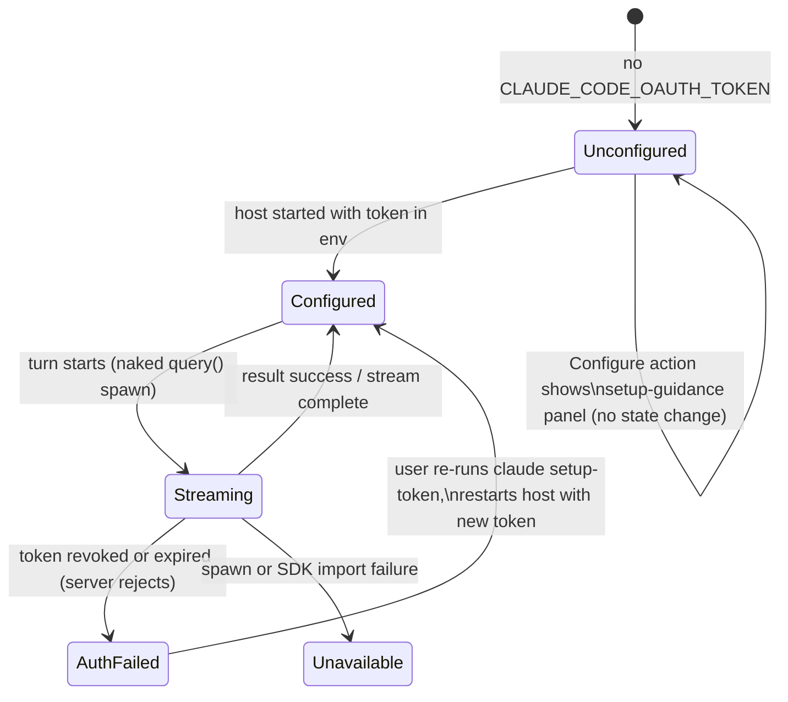

# RFC-01: Claude Agent SDK Subscription Source

## Abstract

Restore the Claude Agent SDK route as a **second** Claude subscription source alongside
the existing pi-ai OAuth source, not replacing it. The SDK source streams each turn as
one "naked" SDK `query()` (custom system prompt fully replacing Claude Code's default,
SDK agent loop terminated after one turn) billed to the user's Pro/Max subscription via
a `claude setup-token` credential. This is the sanctioned, ToS-aligned subscription
path; the current OAuth source hits the Messages API directly with subscription beta
headers, a documented account-dependent risk (53.1 D-004). The dead-Configure-button
failure that motivated deleting the SDK route in 53.1 is already fixed generically by
the 53 D-003 `sourceActionCommand` dispatch; this plan wires the restored source's
`configure` action to the existing `SourceAuthPanel` setup-guidance surface. Whether
the source exposes Trevor's tools (vs. the old text-only cut) is resolved by a spike.

## Introduction

### Problem

Trevor's only Claude subscription source (`anthropic`, plan 53.1) authenticates with a
PKCE OAuth token and streams through pi-ai's `anthropic-messages` path using
subscription beta headers (`oauth-2025-04-20` / `claude-code-20250219`,
`x-api-key: null`). Anthropic's server accepts this because the traffic is shaped like
Claude Code's own; plan 53.1 shipped it while explicitly recording the risk that the
route is account-dependent and may be rejected (D-004), naming `claude setup-token` as
the escape hatch. The owner's original intent was to use the Agent SDK; the SDK
provider that implemented exactly that (`claude-code.ts`, commit `d4ef52a1`) was
deleted in 53.1 (`45699dd6`) because its Configure button was dead - a missing
dispatch-branch bug in `app.tsx`, not anything intrinsic to the SDK route. That
dispatch bug is already fixed (the exhaustive `sourceActionCommand` mapping).

### Scope

**In:**
- A new `claude-code` source row in the host catalog (`SOURCES`), type `oauth` with a
  restored `cliTokenEnv` signal, advertised even when unconfigured.
- The restored SDK provider (from `d4ef52a1`), adapted to the current provider
  contracts (failure normalizer, usage-limit capture, reasoning policy).
- The `configure` action projection for cliTokenEnv sources and the
  `SourceAuthPanel` setup-token guidance copy.
- A spike resolving whether the SDK source can round-trip Trevor's tools in one-turn
  semantics (D-002).
- Naming per D-004: existing OAuth row stays **"Claude subscription"**, new row is
  **"Claude subscription (SDK)"**, Direct API stays **"Anthropic API"** framing.

**Out:**
- Deleting or changing the existing `anthropic` OAuth source (D-001: coexistence).
- A host-spawned interactive `claude setup-token` flow (deferred; guidance panel only,
  D-003).
- Any change to the Anthropic Direct API (`anthropic-api`) source.
- Multi-turn SDK sessions / persisted SDK session state (each turn is a fresh naked
  `query()`, as before).

## Terminology

The key words MUST, MUST NOT, SHOULD, SHOULD NOT, and MAY are to be interpreted as
described in RFC 2119.

- **SDK source**: the new `claude-code` catalog row streaming via
  `@anthropic-ai/claude-agent-sdk`.
- **OAuth source**: the existing `anthropic` row (pi-ai `anthropic-messages` on the
  PKCE `sk-ant-oat` token from `~/.pi/auth.json`).
- **setup token**: the long-lived subscription OAuth credential minted by
  `claude setup-token`, consumed via the `CLAUDE_CODE_OAUTH_TOKEN` env var.
- **Naked query**: one SDK `query()` with a fully-replacing system prompt, no
  filesystem settings, and (in the text-only cut) zero tools, so the SDK's internal
  agent loop ends after a single model turn.

## Motivation

1. **ToS alignment.** The Agent SDK is Anthropic's sanctioned client for subscription
   inference. The OAuth source depends on mimicking Claude Code's headers; if
   enforcement tightens, it breaks (53.1 D-004 acknowledged this). The SDK source is
   the durable path.
2. **Owner intent.** The SDK route was the original design; it was deleted for a UX
   bug that no longer exists, not on its merits.
3. **Redundancy.** Two subscription routes with different failure modes: if one is
   rejected for a given account or breaks on a pi-ai/header drift, the other keeps the
   subscription usable.

## Design

### Catalog row

A `SourceDef` row is added to `SOURCES` in `catalog.ts`:

```ts
{
  sourceId: "claude-code",
  type: "oauth",
  label: "Claude subscription (SDK)",
  piProvider: "anthropic",          // metadata enrichment only; streaming is SDK
  cliTokenEnv: "CLAUDE_CODE_OAUTH_TOKEN",
}
```

- The `cliTokenEnv` field is restored to `SourceDef` (deleted in 53.1). A source with
  `cliTokenEnv` MUST resolve `configured` from that env var's presence (non-empty),
  never from `~/.pi/auth.json`. Concretely: `resolveSourceAuth` gains a `cliTokenEnv`
  branch BEFORE the `oauthName` branch (today an oauth-type row without `oauthName`
  falls through to the static-key predicate and is never configured).
- `loadCatalog`'s oauth credential probe already filters on
  `source.oauthName !== undefined`, so the SDK row is skipped without change - the
  probe exercises `~/.pi/auth.json` refresh, which this row does not have. A test MUST
  lock this in so a future probe refactor does not start probing the SDK row.
- The row MUST be advertised when unconfigured (it is `type: "oauth"`, so the existing
  advertise rule already includes it) so the chooser can offer setup.
- Its unconfigured action MUST project to `configure` (not `authenticate`): there is
  no in-app browser flow for a setup token. This restores a `cliTokenEnv` branch in
  the actions projection: `cliTokenEnv` present → `configure`.
- `providerForSource` MUST dispatch `sourceId === "claude-code"` to the restored
  `claudeCodeProvider`, before the generic oauth branch.
- The model list for the SDK source comes from the pi-ai anthropic static registry
  (same Claude ids as the OAuth source); there is no live `/models` endpoint for the
  SDK. Catalog entries MUST be de-duplicated per source, not across sources - the same
  Claude model id appearing under both subscription rows is correct and intended.

### Provider

`claude-code.ts` is restored from `d4ef52a1` and adapted:

- **Billing hygiene (unchanged):** the SDK child env MUST delete `ANTHROPIC_API_KEY`
  and inject `CLAUDE_CODE_OAUTH_TOKEN`, so a stale API key can never silently bill
  API credits.
- **Fail closed (unchanged):** with no token present, `stream()` MUST fail with a
  typed `ProviderAuthError` and MUST NOT spawn the SDK subprocess.
- **Naked query (unchanged):** `systemPrompt` fully replaces Claude Code's default
  (built by `buildSystemPrompt`, same as every other provider), `settingSources: []`,
  `includePartialMessages: true`, AbortController as a scoped finalizer.
- **Contract adaptations (new):** terminal failures MUST flow through the current
  `normalizeProviderFailure` boundary; the SDK's `SDKRateLimitEvent` SHOULD be mapped
  onto the 44.4 usage-limit event surface (the pi-ai header path equivalent); secrets
  MUST be redacted from any subprocess error text (the token rides the child env).
- **Dependency:** `@anthropic-ai/claude-agent-sdk` returns to `apps/agent-host`
  dependencies, imported lazily so host boot does not load the SDK.

### Tools (spike-gated, D-002)

The old cut was text-only (`capabilities().tools = false`, host tools ignored). The
Agent SDK supports custom in-process tools; whether they work with **one-turn**
semantics (model emits tool_use → host executes → result returns → model continues,
all within Trevor's turn pipeline rather than the SDK's own agent loop) is unverified.

- The spike (S-001) MUST determine whether Trevor's `ToolDef`s can be exposed through
  the SDK such that tool calls round-trip through Trevor's executor.
- If yes: the SDK source ships tool-capable, a full peer of the OAuth source.
- If no: it ships text-only as before, with `capabilities().tools = false`, and the
  chooser copy states the limitation.

### Auth affordance (D-003)

The chooser's existing dispatch handles everything:

- Unconfigured SDK source → action `configure` → `sourceActionCommand` maps it to
  `show-setup-guidance` → the chooser opens with `SourceAuthPanel` showing
  setup-token guidance.
- `authCopy` in `source-auth-panel.tsx` currently hardcodes that EVERY oauth source
  has an in-app sign-in ("Sign in to {label}" + Sign in button). It MUST gain a
  setup-token branch for this row - keyed on the announced action (`configure`) or a
  new source signal, not on the label - instructing: run `claude setup-token`, then
  provide the token to the host via `CLAUDE_CODE_OAUTH_TOKEN` and restart the host.
  It MUST NOT render a paste field (no secret through the browser, 53 D-003 / D-065
  boundary).
- The panel's action button is redundant for this row: `configure` maps to
  `show-setup-guidance`, which opens the chooser panel the button already sits in.
  The panel MUST render the guidance copy directly and SHOULD suppress the
  self-referential button for this row (the copy IS the guidance; there is nothing
  further to open).
- The dead-button failure mode is structurally prevented: `sourceActionCommand` is an
  exhaustive mapping; an unmapped action cannot silently no-op.

### Naming (D-004)

| Row | Label |
|---|---|
| `anthropic` (existing) | Claude subscription |
| `claude-code` (new) | Claude subscription (SDK) |
| `anthropic-api` (existing) | unchanged (Direct API peer) |

Chooser sub-text SHOULD disambiguate: the OAuth row "one-click sign-in", the SDK row
"official Agent SDK; requires `claude setup-token`".

## State Machine

The SDK source's auth/turn lifecycle (per host process; `configured` is env presence,
re-evaluated per catalog snapshot):



Notes:

- There is no in-process transition from `Unconfigured` to `Configured`: the token is
  env-native, so acquiring it requires a host restart (or the deferred spawn flow,
  Alternatives #3). The guidance panel changes no state.
- `AuthFailed` is only discoverable at stream time; env presence cannot detect a dead
  token (Error Handling covers the surfaced copy).

## Error Handling

- No token → typed `ProviderAuthError` carrying the `claude setup-token` hint; the
  chooser shows needs-auth with the guidance panel.
- SDK terminal `result` with error subtype → `ClaudeCodeResultError` → normalized
  `ProviderError` (retryable=false), secrets redacted.
- Subprocess spawn failure / SDK import failure → `ProviderUnavailable` with detail.
- Rate limit → mapped to the usage-limit event surface (44.4), same UI as the OAuth
  source's header-derived events.
- A revoked/expired setup token surfaces as an auth failure on the turn; `configured`
  (env presence) cannot detect deadness ahead of time. The failure copy MUST point at
  re-running `claude setup-token`.
- **Subprocess lifecycle:** the SDK subprocess MUST be torn down on fiber interrupt
  (the AbortController scoped-finalizer bridge, as in the deleted cut) and MUST NOT
  outlive its turn. The hermetic interrupt test pattern from `test/turn.test.ts`
  applies: a hanging SDK stream is interrupted and closes with a cancelled
  completion, leaving no orphaned `claude` process. Subprocess-per-turn latency
  (spawn + SDK boot per query vs a plain HTTPS stream) is an accepted cost of this
  source; the chooser sub-text SHOULD NOT promise latency parity with the OAuth row.
- **Token rotation requires a host restart** (env-native credential). This is stated
  in the guidance copy; no in-process re-read of the env is attempted.

## Security Considerations

- The setup token is a subscription credential. It MUST only live in the host process
  env and the SDK child env; it MUST NOT be written to the session log, transcripts,
  provider observations, or any browser-visible payload. `redactSecrets` MUST cover
  the token pattern in error text.
- The child env is a **copy** of the parent env with `ANTHROPIC_API_KEY` deleted -
  removal, not emptying (empty-string precedence is unreliable in the SDK/CLI).
- The SDK spawns a subprocess with `bypassPermissions`; because zero filesystem
  settings and (absent the spike passing) zero tools are exposed, the subprocess has
  no delegated capability surface. If the spike enables tools, tool execution MUST
  remain in Trevor's host executor with its existing guardrails - the SDK subprocess
  never executes tools itself.
- No secret transits the browser: the guidance panel shows instructions only.

## Alternatives Considered

1. **Replace the OAuth source with the SDK source.** Rejected (D-001): loses the
   one-click in-app sign-in; the owner wants both available.
2. **Feed the OAuth PKCE token to the SDK (`CLAUDE_CODE_OAUTH_TOKEN=sk-ant-oat…`).**
   Rejected: the PKCE access token is short-lived and refresh is owned by pi-ai; the
   SDK holds a stale env copy and cannot refresh, so turns fail on rotation. Two
   credential managers fighting over one credential.
3. **Host-spawned `claude setup-token` from the Configure button.** Deferred (D-003):
   best UX but requires new interactive-subprocess plumbing; the guidance panel ships
   first and the spawn flow can layer on later without contract changes.
4. **Store the setup token in `~/.pi/auth.json`.** Rejected for this cut: that store
   is pi-ai's; the SDK credential is env-native (`CLAUDE_CODE_OAUTH_TOKEN` is the
   SDK's own contract), and mixing stores re-creates the collision plan 53 D-003
   untangled.

## Implementation Plan

- **Phase 0 (spike S-001):** one-turn tool round-trip through the Agent SDK. Output:
  tool-capable or text-only decision.
- **Phase 1 (host):** restore + adapt `claude-code.ts` and its tests; restore
  `cliTokenEnv` on `SourceDef`, the configured-signal branch, the `configure` action
  projection, and the `providerForSource` dispatch; SDK dependency returns to
  `package.json`.
- **Phase 2 (web):** `SourceAuthPanel` setup-token guidance copy for the SDK row;
  chooser sub-text disambiguation; stories + jsdom tests.
- **Gate:** unit + integration + web green, hermetic e2e lane green; a live-model
  smoke against the real SDK is gated on `CLAUDE_CODE_OAUTH_TOKEN` presence (skips
  with reason when absent).

## Open Questions

1. **SDK one-turn tool semantics (S-001).** Can the Agent SDK expose host-executed
   tools without its own agent loop taking over the turn? Decision criteria: a
   tool_use block MUST reach Trevor's executor and the result MUST return within the
   same `query()` without the SDK spawning nested turns or requiring filesystem
   permissions. If the SDK cannot do this cleanly, ship text-only.
2. **SDK version.** The deleted cut pinned `@anthropic-ai/claude-agent-sdk@0.3.199`.
   Current latest MUST be evaluated during Phase 1; the event shapes
   (`stream_event`/`result`) and `Options` fields used here need re-verification
   against the installed version.
3. **Reasoning surface.** The SDK has no per-turn reasoning-effort option (old cut:
   model-driven). Is that acceptable for parity with the OAuth source, or should the
   row advertise a reduced reasoning surface in the chooser?
4. **Source type.** This RFC reuses `type: "oauth"` with a `cliTokenEnv` override,
   which forces special-case branches in `resolveSourceAuth`, the actions projection,
   and `authCopy`. A distinct `SourceType` (e.g. `"cli-token"`) would make each
   branch structural instead of an exception, at the cost of widening a shared union
   consumed by web. Decide in DECOMPOSE: count the special cases; if 3+ sites branch
   on "oauth but not really", a new type is the cleaner cut.

## References

**Normative:**
- Deleted provider: `git show d4ef52a1:apps/agent-host/src/providers/claude-code.ts`
- Deletion + rationale: `45699dd6`, plan 53.1
  (`c4a5cd3d:.plans/53.1-claude-subscription-signin/implementation.md`, D-001/D-002/D-004)
- Current catalog contracts: `apps/agent-host/src/providers/catalog.ts`
- Action dispatch: `apps/web/src/app.tsx` (`sourceActionCommand`), 53 D-003

**Informative:**
- Anthropic Agent SDK docs (`@anthropic-ai/claude-agent-sdk`)
- Plan 44.4 usage-limit events (header path; `SDKRateLimitEvent` re-thread)
